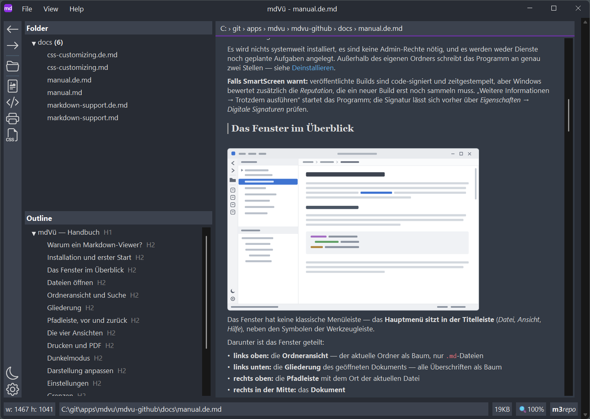

# mdVü — Handbuch

Markdown-Viewer für Windows · © 2026 Martin Niedergesäß — m3Works · *[English version](manual.md)*

---

Dies ist das ausführliche Handbuch für alle, die das ganze Bild wollen — samt Installation, Einstellungen und Fehlersuche. Eine kürzere Fassung steckt im Programm selbst: Taste `F1`.

**Inhalt**

- [Warum ein Markdown-Viewer?](#warum-ein-markdown-viewer)
- [Installation und erster Start](#installation-und-erster-start)
- [Das Fenster im Überblick](#das-fenster-im-überblick)
- [Dateien öffnen](#dateien-öffnen)
- [Ordneransicht und Suche](#ordneransicht-und-suche)
- [Gliederung](#gliederung)
- [Lesen mit der Tastatur](#lesen-mit-der-tastatur)
- [Pfadleiste, vor und zurück](#pfadleiste-vor-und-zurück)
- [Die vier Ansichten](#die-vier-ansichten)
- [Drucken und PDF](#drucken-und-pdf)
- [Dunkelmodus](#dunkelmodus)
- [Screenreader](#screenreader)
- [Darstellung anpassen](#darstellung-anpassen)
- [Einstellungen](#einstellungen)
- [Grenzen](#grenzen)
- [Tastaturkürzel](#tastaturkürzel)
- [Kommandozeile](#kommandozeile)
- [Fehlersuche](#fehlersuche)
- [Deinstallieren](#deinstallieren)

## Warum ein Markdown-Viewer?

Es gibt hervorragende Markdown-*Editoren* — Obsidian, Typora, VS Code und viele mehr. Warum also noch ein Viewer?

Weil Lesen etwas anderes ist als Schreiben. Wer schnell eine Notiz nachschlagen, eine Doku überfliegen oder eine per Mail erhaltene `.md`-Datei einfach nur *ansehen* will, braucht keinen Editor mit Plugins, Vault und Sync — sondern ein Programm, das sofort startet, die Datei anzeigt und wieder aus dem Weg ist.

mdVü ist genau dafür gebaut:

- **Schlank:** eine einzelne EXE unter 15 MB, keine Installation von Frameworks oder Laufzeitumgebungen.
- **Schnell:** native Windows-Anwendung mit eigener Render-Engine. Auch große Dokumente öffnen ohne spürbare Wartezeit.
- **Sparsam:** benötigt nur einen Bruchteil des Arbeitsspeichers Chromium-basierter Editoren, die für jedes Fenster einen kompletten Browser mitbringen.
- **Ergänzung, kein Ersatz:** mdVü will Obsidian & Co. nicht verdrängen. Es ist das Werkzeug für den schnellen Blick — Datei im Explorer doppelklicken, lesen, fertig. Der Editor bleibt fürs Schreiben zuständig.

## Installation und erster Start

Es gibt keinen Installer. mdVü ist eine einzelne ausführbare Datei:

1. `mdvu.exe` dorthin legen, wo es passt — Programmordner, USB-Stick, synchronisierter Ordner. Es läuft von überall.
2. Starten. Beim allerersten Start wird die Lizenz angezeigt und ist einmalig zu bestätigen.
3. Optional: *Datei → Als Markdown-Standard registrieren* sorgt dafür, dass `.md`-Dateien per Doppelklick in mdVü aufgehen.

Es wird nichts systemweit installiert, es sind keine Admin-Rechte nötig, und es werden weder Dienste noch geplante Aufgaben angelegt. Außerhalb des eigenen Ordners schreibt das Programm an genau zwei Stellen — siehe [Deinstallieren](#deinstallieren).

**Falls SmartScreen warnt:** veröffentlichte Builds sind code-signiert und zeitgestempelt, aber Windows bewertet zusätzlich die *Reputation*, die ein neuer Build erst noch sammeln muss. „Weitere Informationen → Trotzdem ausführen“ startet das Programm; die Signatur lässt sich vorher über *Eigenschaften → Digitale Signaturen* prüfen.

## Das Fenster im Überblick



Das Fenster hat keine klassische Menüleiste — das **Hauptmenü sitzt in der Titelleiste** (*Datei*, *Ansicht*, *Hilfe*), neben den Symbolen der Werkzeugleiste.

Darunter ist das Fenster geteilt:

- **links oben:** die **Ordneransicht** — der aktuelle Ordner als Baum, nur `.md`-Dateien
- **links unten:** die **Gliederung** des geöffneten Dokuments — alle Überschriften als Baum
- **rechts oben:** die **Pfadleiste** mit dem Ort der aktuellen Datei
- **rechts in der Mitte:** das **Dokument**
- **unten:** die Statuszeile mit Angaben zum Dokument und Hinweisen, dazu, wo die Datei liegt (Obsidian-Vault, Git-Repository)

`F6` schaltet den Tastaturfokus reihum zwischen den Bereichen weiter.

## Dateien öffnen

Es gibt mehrere Wege, eine Datei zu öffnen:

- **Drag & Drop:** eine `.md`-Datei oder einen ganzen **Ordner** auf das Fenster ziehen. Ein Ordner wird in der Ordneransicht geöffnet und zeigt seine Ordnerseite. Wird mehreres zugleich fallengelassen, hat eine Datei Vorrang vor einem Ordner.
- **Öffnen-Dialog** mit `Strg+O`.
- **Startseite** (*Datei → Start page*): die zuletzt geöffneten Dateien und Ihre Favoriten, je einen Klick entfernt. Sobald Sie einmal eine Datei geöffnet haben, startet mdVü mit dieser Seite; die Willkommensseite des Erststarts steht im Menü *Hilfe*.
- **Ordneransicht:** Ein Klick auf eine Datei im Ordnerbaum links oder das Durchblättern mit den Pfeiltasten zeigt sie sofort an — aber nur zum **Hineinschauen** (Peek): Sie landet weder im Verlauf (*Zurück*) noch in den zuletzt benutzten Dateien, und die Pfadleiste zeigt ihren Namen *kursiv*. `Enter` oder ein Doppelklick öffnet die Datei richtig und setzt den Fokus ins Dokument; ein Klick ins Dokument oder `F6` macht dasselbe mit einer angesehenen Datei. `Strg+Umschalt+E` führt zurück in die Ordneransicht. Ein **Ordner** erscheint als eigene Seite: seine Unterordner und Markdown-Dateien mit Größe, Datum und den ersten Zeilen jeder Datei. `Enter` (oder ein Klick in die Seite) wechselt hinein, bereit für die Tastatur — die Pfeiltasten gehen von Link zu Link, `Enter` öffnet eine Datei oder einen Unterordner. Öffnen Sie eine Datei oder einen Ordner, die zu einem Obsidian-Vault oder Git-Repository gehören — per Kommandozeile, Dateidialog, Drag & Drop, Link, Pfadleiste oder aus den zuletzt benutzten Dateien —, zeigt die Ordneransicht den **ganzen Vault bzw. das ganze Repository** und markiert darin die Datei oder den Ordner; bei Verschachtelung den inneren Vault bzw. das innere Repository. Solange Sie sich darin bewegen, bleibt die Ordneransicht stehen. Dateien und Ordner, deren Name mit einem Punkt beginnt (`.git`, `.obsidian` …), werden nicht angezeigt (Einstellung `ui/folderTreeHideDot`).
- **Zuletzt verwendet:** Das *Datei*-Menü führt die zuletzt geöffneten Dateien und Ordner. Auch die **Startseite** (*Datei → Startseite*) zeigt die letzten fünf Dateien.
- **Doppelklick im Explorer:** Über *Datei → Als Markdown-Standard registrieren* verknüpft sich mdVü mit `.md`-Dateien (pro Benutzer, keine Admin-Rechte nötig). Windows fragt ggf. einmalig per „Öffnen mit“ nach — siehe [Fehlersuche](#fehlersuche).
- **Kommandozeile:** `mdvu.exe "C:\Notizen\Liesmich.md"` — siehe [Kommandozeile](#kommandozeile).

Wird die angezeigte Datei von einem anderen Programm geändert, lädt mdVü sie automatisch neu — die Scrollposition bleibt erhalten. Mit `F5` geht das auch von Hand. Dateien, die im aktuellen Ordner hinzukommen oder verschwinden, erscheinen im Baum ohne manuelles Auffrischen; das gilt rekursiv, also auch für Unterordner.

Sehr große Dateien werden bis zu einer Grenze von **50 MB** geladen — ein Banner am Dokumentanfang weist darauf hin, dass nur der Anfang angezeigt wird. Siehe [Grenzen](#grenzen).

## Ordneransicht und Suche

Die Ordneransicht zeigt den Ordner des aktuellen Dokuments, gefiltert auf `*.md`. Sie ist kein Vault und kein Workspace: es ist schlicht der Ordner, in dem man gerade ist, und sie folgt der Navigation. In einem Obsidian-Vault oder Git-Repository zeigt der Baum alle Unterordner, sonst zwei Ebenen tief — damit etwa `C:\` nicht das ganze Laufwerk durchsucht.

**Zuletzt geändert.** Ein farbiger Punkt hinter einer Datei zeigt, wie lange die letzte Änderung her ist — rot bis 10 Minuten, orange bis eine Stunde, gelb bis ein Tag, grau bis eine Woche. Ein Ordner zeigt den Punkt der zuletzt geänderten Datei darin, auch wenn er zugeklappt ist. Die Punkte gehen mit, solange mdVü offen ist, auch bei Änderungen durch andere Programme, und eine eben geänderte oder neue Datei leuchtet kurz auf. Die Uhr ⏱ im Kopf der Ordneransicht filtert den Baum: nur Dateien zeigen, die in den letzten 10 oder 30 Minuten, der letzten Stunde, dem letzten Tag oder der letzten Woche geändert wurden. Der Filter bleibt beim Suchen in der Ordneransicht und beim Wechsel in einen anderen Ordner eingeschaltet; beim nächsten Start ist er wieder aus.

`Strg+F` öffnet den Suchstreifen für das Haupt-Pane — also für die gerade sichtbare Ansicht: Dokument, Quelltext, CSS oder Druckvorschau. `F3` und `Umschalt+F3` springen zum nächsten bzw. vorherigen Treffer im Haupt-Pane, egal wo der Fokus gerade steht: im Suchfeld, im Dokument, auch in Ordneransicht oder Gliederung. Man kann also weiterlesen und mit `F3` weiterspringen.

`Strg+F3` sucht dort, wo Sie gerade sind — der Bereich mit dem Tastaturfokus bekommt den Streifen. Nur so erreicht man Ordneransicht und Gliederung, und anders als `Strg+F` schaltet diese Taste den Streifen auch wieder aus.

In der **Ordneransicht** und in der **Gliederung** erscheint der Streifen über dem Baum. Während der Eingabe wird der Baum gefiltert — auf passende Dateien bzw. Überschriften —, Treffer werden hervorgehoben. Die Pfeil-runter-Taste setzt den Fokus vom Suchfeld in den Baum — tippen, dann blättern, ganz ohne Maus. Nach dem Schließen ist der Baum wieder so aufgeklappt wie vor der Suche.

Im **Dokument, im Quelltext, im CSS-Editor und in der Druckvorschau** erscheint der Streifen unter der Pfadleiste und arbeitet wie die Suchleiste eines Browsers: `Eingabe` und `Umschalt+Eingabe` gehen durch die Treffer (im Dokument führt ein weiteres `Eingabe` stattdessen in den Text — s. *Lesen mit der Tastatur*), ein Zähler zeigt *Treffer / gesamt*, und alle Treffer sind gleichzeitig hervorgehoben. Drei Umschalter verfeinern die Suche:

| Umschalter | Bedeutung |
|---|---|
| `Aa` | Groß-/Kleinschreibung beachten (standardmäßig aus) |
| `.*` | Suchtext als regulären Ausdruck lesen |
| `Sel` | Suche auf die aktuelle Auswahl beschränken (nur im Dokument; braucht eine nicht-leere Auswahl) |

Im **Dokument** durchsucht mdVü immer den ganzen Text — auch Teile sehr großer Dateien, die noch gar nicht angezeigt wurden; gefunden wird, was man sieht (`foo` trifft auch `**fo**o`, aber nicht eine Link-Adresse). Beim Tippen sucht mdVü erst, wenn Sie kurz innehalten (0,3 Sekunden), und erst ab **3 Zeichen** — so bleibt die Eingabe auch in großen Dokumenten flüssig. `Eingabe` und `F3` suchen sofort, auch kürzere Begriffe. Steht der Begriff in Anführungszeichen (`"ab"`), wird genau dieser Text gesucht, auch wenn er kurz ist oder am Rand Leerzeichen hat. Bei sehr vielen Treffern werden die ersten 10 000 markiert; die Statuszeile sagt Bescheid.

Nochmal `Strg+F3`, `Esc` oder der `X`-Knopf schließt den Streifen — Hervorhebungen verschwinden, der Ordnerfilter wird aufgehoben. Der Suchbegriff selbst bleibt erhalten: `Strg+F` holt ihn wieder ins Feld, `F3` nimmt die Suche beim ersten Treffer wieder auf. Damit kann `F3` auch ohne sichtbaren Streifen Hervorhebungen im Dokument stehen lassen; `Esc` im Dokument räumt sie weg.

Es ist immer höchstens ein Streifen offen; ein Ansichtswechsel schließt den Streifen des Haupt-Panes (die Streifen über den Bäumen bleiben).

Hinweis zur Druckvorschau: Sie durchsucht, was tatsächlich paginiert wurde. Dokumente, die an der 200-Seiten-Grenze abgeschnitten sind, enden auch für die Suche dort.

## Suchen in Dateien

`Strg+Umschalt+F` öffnet einen Streifen, der **alle Markdown-Dateien** eines Bereichs auf einmal durchsucht. Den Bereich wählen Sie neben dem Suchfeld:

| Bereich | Was er umfasst |
|---|---|
| Vault | den Obsidian-Vault des aktuellen Dokuments |
| Repository | das Git-Repository des aktuellen Dokuments |
| Ordner | den Ordner der Ordneransicht samt Unterordnern |
| Alle Favoriten | alle Ordner unter Ihren Favoriten auf einmal; die Treffer nach Favorit gruppiert |

Vorausgewählt ist der engste Bereich — im Vault der Vault, im Repository das Repository, sonst der Ordner. Markierter Text oder der Begriff einer laufenden Dokumentsuche wird übernommen. `Enter` startet die Suche; zeigt das Dokument schon die Trefferliste genau dieser Suche, setzt `Enter` stattdessen den Fokus in die Liste (`F5` sucht neu). `↓` landet immer in der Liste — sind Begriff oder Schalter seither geändert, wird vorher gesucht, man landet also nie in alten Ergebnissen. `Aa` beachtet Groß-/Kleinschreibung; ein Begriff in Anführungszeichen (`"ab"`) sucht genau diesen Text. Zwei weitere Umschalter legen Wortgrenzen fest — es ist immer höchstens einer an:

| Umschalter | Bedeutung |
|---|---|
| `ab…` | Wortanfang, auch nach Bindestrich oder Satzzeichen: `der` findet *derzeit* und *Nord-der*, aber nicht *oder* |
| `\|ab\|` | nur ganze Wörter |

Suchen beim Tippen gibt es hier nicht: eine Suche über Tausende Dateien beginnt erst, wenn Sie sie anstoßen.

Das Ergebnis ist ein **eigenes Dokument** mit eigenem Platz im Verlauf:

- zuerst die Dateien, deren **Name** passt, auch ohne Treffer im Text;
- dann die Treffer nach Ordnern gruppiert — jede Datei mit der Zahl ihrer Treffer und bis zu drei Zeilen Kontext, der Treffer hervorgehoben;
- ein Klick auf den Dateinamen öffnet die Datei am ersten Treffer, ein Klick auf eine Zeilennummer genau an diesem Treffer. Die Dokumentsuche ist dort schon belegt, `F3` geht also in der Datei weiter. Die Liste öffnet bereit für die Tastatur: Pfeiltasten oder `Tab` gehen von Treffer-Link zu Treffer-Link, `Eingabe` öffnet ihn (s. *Lesen mit der Tastatur*).

**Zurück** (`Alt+←`) führt zur Trefferliste an die Stelle, von der Sie kamen. Die Liste wird aufbewahrt — die letzten fünf Trefferlisten hält mdVü im Speicher —, sie sieht also genauso aus wie vorher, auch wenn sich Dateien inzwischen geändert haben. `F5` auf der Trefferliste sucht neu. Weil die Liste ein Dokument ist, können Sie darin suchen (`Strg+F`), sie drucken oder als PDF speichern, und ihre Gliederung zeigt die Ordner und Dateien.

Große Ordner werden im Hintergrund durchsucht: die Liste wächst, während Sie lesen, die Fußzeile zeigt den Fortschritt. Wer ein anderes Dokument öffnet, bricht eine laufende Suche ab; zurück auf der Liste wird dann neu gesucht. Dateien über der Ladegrenze (`doc/maxLoadMB`) werden wie in der Anzeige bis zu dieser Grenze durchsucht; die Liste kennzeichnet sie.

mdVü durchsucht **den Text, den Sie sehen** — in Dateien genau wie im Dokument, beide zählen also dieselben Treffer: Frontmatter (Eigenschaften) gehört dazu und ist in der Liste gekennzeichnet, `%%Kommentare%%`, Linkziele und Markdown-Auszeichnung dagegen nicht. Die Suche in Obsidian findet Kommentare. Versteckte Ordner (mit Punkt am Anfang, etwa `.obsidian` oder `.git`) werden übersprungen, durchsucht werden nur `*.md`-Dateien.

## Gliederung

Unterhalb der Ordneransicht zeigt mdVü die **Gliederung** des aktuellen Dokuments — alle Überschriften als Baum, nach Ebenen verschachtelt. Ein Klick springt zur entsprechenden Stelle im Dokument; das Sprungziel leuchtet kurz auf, damit das Auge es sofort findet. Wie in der Ordneransicht schauen Klick und Pfeiltasten nur hinein; erst `Enter` oder ein Doppelklick nimmt den Sprung in den Verlauf auf, *Zurück* führt dann wieder zu diesem Kapitel.

Bei einem langen Dokument ist die Gliederung der schnellste Weg: kein Scrollen, kein Suchen, ein Klick. Bei sehr vielen Überschriften hilft `Strg+F3` mit dem Fokus in der Gliederung: Der Streifen filtert sie auf die Überschriften, die den Suchtext enthalten — samt der übergeordneten, damit man sieht, wo sie stehen.

## Lesen mit der Tastatur

mdVü ist ein Leser, das Dokument braucht also nicht ständig einen Textcursor — die Tasten sind frei, um sich in **Einheiten** durchs Dokument zu bewegen, ähnlich wie man im Browser per Tab durch die Links geht. Der Footer zeigt immer die aktive Einheit:

| Taste | Einheit | Footer | Pfeiltasten |
|---|---|---|---|
| `0` | Scrollen | `SCROLL` | scrollen wie im Browser, ebenso `Bild↑`/`Bild↓` und `Pos1`/`Ende` (Grundeinstellung) |
| `1` | Caret | `CARET` | bewegen einen Textcursor zeichen- und zeilenweise, wie nach einem Klick in den Text |
| `L` | Links | `LINK 3/41` | `←`/`→` voriger/nächster Link in Lesereihenfolge, `↑`/`↓` nächstgelegener Link in der Zeile darüber/darunter |
| `H` | Treffer | `HIT 2/17` | gehen durch die Treffer der Dokumentsuche (`Strg+F`) |

Ein Klick auf die Einheit im Footer öffnet ein Menü mit allen Einheiten.

`F7` schaltet zwischen Scrollen und Caret um (wie *Caret Browsing* im Browser). `Tab` und `Umschalt+Tab` gehen immer zum nächsten/vorigen Link, egal welche Einheit gilt, und `Eingabe` folgt dem aktiven Link — bzw. dem Link am Caret. Der erste Link ist der erste **im Bild**, nicht der erste im Dokument; der aktive Link ist hervorgehoben (CSS: `highlight.nav`). `↑`/`↓` bewegen sich wirklich senkrecht: Sie überspringen die übrigen Links derselben Zeile und gehen zum nächstgelegenen Link in der nächsten Zeile darüber bzw. darunter, die einen hat.

Der Weg aus der Suche: In der Suchleiste des Dokuments sucht das erste `Eingabe`, jedes weitere `Eingabe` — und `↓` jederzeit — setzt den Fokus ins Dokument mit der Einheit *Treffer*, `←`/`→` gehen dann durch die Treffer weiter. Die Trefferliste von *Suchen in Dateien* öffnet mit der Einheit *Links*: sobald Sie hineinwechseln, ist der erste Link im Bild hervorgehoben, `Eingabe` öffnet ihn. Die Markierung bleibt an ihrem Ziel, auch wenn eine große Suche noch Ergebnisse nachliefert.

Ein Klick in den Text schaltet auf den Caret. `Esc` geht den Weg zurück, den Sie gekommen sind: von Links oder Treffern ins Feld des offenen Suchstreifens (Dokumentsuche oder Suchen in Dateien) — ein zweites `Esc` dort schließt ihn und führt zurück ins Dokument beim Scrollen —, ohne Streifen direkt zum Scrollen. Die Einheit gehört zum Ort im Verlauf: **Zurück** bringt sie wieder, samt aktivem Link. Wer in der Einheit *Links* einem Link folgt, bleibt darin — das nächste Dokument beginnt beim ersten Link im Bild. Ein Link, der eine Suche mitbringt (wie die Treffer von *Suchen in Dateien*), öffnet stattdessen mit dieser Suche. Die Tasten `2` bis `5` sind für Wörter, Sätze, Absätze und Überschriften reserviert. Links funktionieren auch in sehr großen Dokumenten, auch in Teilen, die noch nicht angezeigt wurden.

## Favoriten

Ordner, zu denen Sie oft zurückkehren — Ihre Vaults, Ihre Repositories —, lassen sich als **Favoriten** merken. `Strg+D` nimmt den Ordner der Ordneransicht auf oder entfernt ihn wieder; der **Stern** in der Leiste ist gefüllt, wenn der aktuelle Ordner ein Favorit ist. Ein Klick auf den Stern (oder `Strg+Umschalt+D`) öffnet die Liste: Pfeiltasten und `Enter` öffnen einen Favoriten, `Entf` entfernt den markierten. Die Favoriten stehen auch im Menü **File**, und das Menü zu einer Datei oder einem Ordner (Rechtsklick in der Ordneransicht) nimmt sie auf oder entfernt sie. Die Suche in Dateien kann **alle Favoriten** auf einmal durchsuchen. mdVü speichert sie in `favorites.yaml` bei den übrigen Einstellungen.

## Pfadleiste, vor und zurück

Über dem Dokument zeigt die **Pfadleiste** den Ort der aktuellen Datei. Jedes Segment ist klickbar: Ein Klick auf einen Ordner öffnet ihn in der Ordneransicht und zeigt seine Ordnerseite.

**Das Menü zur Datei.** Ein Klick auf den Dateipfad in der Statuszeile öffnet ein Menü zu dieser Datei: Pfad kopieren, im Explorer zeigen, in Obsidian öffnen (innerhalb eines Vaults) oder mit einem anderen Programm, das für `.md`-Dateien installiert ist. Dasselbe Menü öffnet ein Rechtsklick auf eine Datei oder einen Ordner in der Ordneransicht oder auf die **Obs**/**Git**-Plakette in der Statuszeile — in der Ordneransicht auch per Tastatur mit `Umschalt+F10` oder der Kontextmenü-Taste.

Wie im Browser navigiert mdVü durch die Historie: Pfeil-Symbole in der Leiste oder `Alt+←` / `Alt+→`. Ein **Rechtsklick auf die Pfeile** öffnet die Verlaufsliste — damit lässt sich ein früheres Dokument direkt anspringen, statt sich Schritt für Schritt zurückzuklicken.

**Zurück führt an die Stelle, an der Sie waren** — nicht an den Dokumentanfang. mdVü merkt sich dafür die oberste sichtbare Zeile im Text, nicht eine Pixelposition; das passt auch dann noch, wenn sich Fensterbreite oder Zoom inzwischen geändert haben oder das Dokument erst stückweise nachgeladen wird. Ist die Datei inzwischen kürzer geworden, landet man am Ende. Eine laufende Suche im Dokument kommt mit zurück: Suchbegriff, Optionen, aktiver Treffer und Streifen. Wer die Suche vor dem Weitergehen mit `Esc` geschlossen hat, findet sie beim Zurückblättern auch nicht wieder.

Links innerhalb von Dokumenten funktionieren wie erwartet: ein relativer Link auf eine andere `.md`-Datei öffnet diese Datei, ein Link auf eine Überschrift (`#abschnitt`) springt im Dokument, ein `http(s)`-Link geht nach Rückfrage in den Browser. Links, die ins Leere oder ins Zwielichtige führen, werden abgelehnt statt befolgt. Ein Link der Form `mdvu:open?uri=…&find=…` bzw. `&mark=…` öffnet ein Dokument und markiert dabei Fundstellen oder Zeilen — siehe [Fundstellen verlinken](markdown-support.de.md#fundstellen-verlinken).

## Die vier Ansichten

Der Dokumentbereich beherbergt vier austauschbare Ansichten:

| Ansicht | Kürzel | Wofür |
|---|---|---|
| **Markdown** | `Strg+1` | das gerenderte Dokument — die normale Ansicht |
| **Quelltext** | `Strg+2` | der rohe Markdown-Text, syntaxgefärbt, nur lesend |
| **CSS** | `Strg+4` | das eigene Stylesheet, siehe [Darstellung anpassen](#darstellung-anpassen) |
| **Druckvorschau** | `Strg+F2` oder `Strg+3` | das umbrochene Dokument, so wie es druckt |

Beim Zurückschalten von der CSS-Ansicht auf die Markdown-Ansicht wird das geänderte Stylesheet sofort angewandt.

## Drucken und PDF

mdVü bringt eine eigene Druck- und PDF-Ausgabe mit — kein Umweg über den Browser oder einen PDF-Druckertreiber:

- **Druckvorschau** (`Strg+F2`): auch bei umfangreichen Dokumenten stehen 100 Seiten in wenigen Sekunden bereit.
- **Seiteneinrichtung:** Eine Leiste oben in der Druckvorschau wählt Drucker, Papierformat (A3, A4, A5, A6, Letter, Legal) und Hoch- oder Querformat. Die Vorschau wird sofort neu umbrochen, Druck und PDF verwenden genau dieses Format — was die Vorschau zeigt, kommt aus dem Drucker. *Printer setup…* öffnet die Windows-Druckereinstellungen, ohne zu drucken; dort gewählter Drucker, Papierformat und Ausrichtung werden übernommen. Ein- und ausblenden mit `Strg+Umschalt+P` (*Ansicht → Page setup*), schließen mit `Esc`. Die Auswahl bleibt gespeichert. Papierformate außerhalb der Liste werden noch nicht unterstützt; liefert der Druckerdialog eines, behält mdVü das in der Leiste eingestellte Format.
- **Natives PDF:** *Ansicht → Als PDF exportieren* erzeugt ein echtes Vektor-PDF mit kopierbarem Text und einem Lesezeichen-Baum aus den Überschriften des Dokuments. Die Dateien sind in der Regel kleiner als bei „Drucken als PDF“ über einen Druckertreiber.
- **Saubere Seitenumbrüche:** Beim Umbruch werden verwaiste Zeilen berücksichtigt — eine einzelne Absatzzeile bleibt nicht allein am Seitenende oder Seitenanfang stehen.
- **Überbreite Tabellen** werden automatisch eingepasst: Die Schrift wird maßvoll verkleinert (bis 70 %), was dann noch übersteht, wird am rechten Seitenrand abgeschnitten — die wichtigen Spalten also nach links stellen. Langtext-Spalten werden bei knappem Platz auf 30 % der Seitenbreite gedeckelt. Das bisherige Verhalten (alle Spalten auf die Seite quetschen) bleibt über die Einstellung `print/tableFit = squeeze` verfügbar.
- **Drucken** direkt aus der Ansicht mit `Strg+P`. Der Druckdialog startet mit Drucker und Papier aus der Seiteneinrichtung, Änderungen darin fließen in die Vorschau zurück.

Die Druck- und PDF-Ausgabe ist immer hell, unabhängig vom Dunkelmodus der Anzeige — ein dunkler Seitengrund würde Toner verschwenden und sich auf Papier schlecht lesen. Vorschau, Druck und PDF sind auf die ersten **200 Seiten** begrenzt; wird ein Dokument gekürzt, erscheint ein Hinweis in der Statuszeile.

## Zeilenumbrüche, Obsidian und Git

Standardmäßig folgt mdVü dem Markdown-Standard (CommonMark): Ein einfacher Zeilenumbruch innerhalb eines Absatzes wird zum Leerzeichen. Umbrochen wird nur, wo eine Zeile mit zwei Leerzeichen oder einem Backslash `\` endet. Programme wie Typora und Obsidian brechen dagegen an jeder Zeile um.

Liegt eine Datei in einem **Obsidian-Vault** (ein Ordner mit `.obsidian`), übernimmt mdVü dessen Einstellung *Strict line breaks* — die Notiz sieht aus wie in Obsidian. Für alle anderen Dateien schaltet `doc/lineBreaks = newline` in der `settings.ini` auf „jede Zeile ein Umbruch" um.

Die Statuszeile zeigt, wo eine Datei liegt: **Obs** für einen Obsidian-Vault, **Git** für ein Git-Repository, **Obs/Git**, wenn beide denselben Ordner haben. Ein Klick öffnet diesen Ordner in der Ordneransicht.

**Wikilinks** wie `[[Notiz]]` und Einbettungen wie `![[bild.png]]` löst mdVü in einem Vault auf wie Obsidian: über den Namen, irgendwo im Vault. `[[Notiz#Überschrift]]` öffnet die Notiz und springt zur Überschrift — ebenso ein Markdown-Link wie `[Details](notiz.md#installation)`. Einzelheiten stehen in der [Markdown-Referenz](markdown-support.de.md#wikilinks).

## Dunkelmodus

*Ansicht → Dark Mode* schaltet die komplette Oberfläche samt Dokument um. Die Einstellung wird gemerkt.

Der Dunkelmodus im Dokument ist vollständig CSS-getrieben: Das eingebaute dunkle Stylesheet wird über das helle gelegt. Das ist wichtig, sobald man eigenes CSS schreibt — [Anpassen per CSS](css-customizing.de.md) erklärt, warum eine nur für den Dunkelmodus gesetzte Farbe beim Zurückschalten „hängenbleiben“ kann.

## Screenreader

mdVü zeichnet das Dokument selbst, und Screenreader (NVDA, JAWS, Windows-Sprachausgabe) können diese Ansicht noch nicht lesen. Bis dahin öffnet `Strg+Umschalt+B` (*Ansicht → Read in browser*) das aktuelle Dokument als Webseite im Standardbrowser — mit Überschriften, Listen, Tabellen und Links, mit denen jeder Screenreader gut umgehen kann. Die Seite wird in einem temporären Ordner abgelegt; nichts verlässt Ihren Rechner. Ordnerbaum und Gliederung funktionieren bereits mit Screenreadern: Sie sagen den Namen der gewählten Datei bzw. Überschrift an.

## Darstellung anpassen

Über *Ansicht → CSS* (`Strg+4`) lässt sich ein eigenes Stylesheet bearbeiten, das über die eingebauten Vorgaben gelegt wird. Damit können z.B. Schriftart, Schriftgröße, Farben und Abstände angepasst werden. Die Datei (`user.css`) liegt im Einstellungsordner und bleibt über Updates hinweg erhalten.

Beim ersten Start ist sie mit einem Kommentar und einer Zeile vorbelegt:

```css
@import "builtin:default.css";
```

Diese Zeile ist der Schalter für das eingebaute Design. Bleibt sie stehen, legen sich die eigenen Regeln darüber. Wird sie aus einer nicht-leeren `user.css` entfernt, lädt mdVü weder das Standard-Stylesheet noch dessen dunkles Gegenstück — dann gestaltet man von Null an.

Wichtig zu wissen: mdVü unterstützt bewusst nur eine **Teilmenge** von CSS — nicht alles, was ein Browser mit HTML5 kann. Der Umfang ist absichtlich klein gehalten, denn genau daraus bezieht mdVü seine Geschwindigkeit und seinen geringen Speicherbedarf. Tipp: Schriftgrößen in `pt` angeben, dann skaliert die Anzeige sauber mit der Bildschirm-DPI.

Die vollständige Referenz mit durchgerechneten Beispielen steht in [Anpassen per CSS](css-customizing.de.md).

## Einstellungen

Einen Einstellungsdialog gibt es noch nicht. *Hilfe → Setting* öffnet einen kleinen Hinweis mit einem klickbaren Link auf den Einstellungsordner:

```
%APPDATA%\m3Works\mdVu
```

Darin liegen `settings.ini` (Werte), `user.css` (das eigene Stylesheet) und `favorites.yaml` (die Favoriten). Werte werden sofort geschrieben — mdVü verliert bei einem Absturz keine Einstellung, das heißt aber auch: **vor dem Bearbeiten der `settings.ini` von Hand das Programm schließen**, sonst werden die Änderungen wieder überschrieben.

Die Schlüssel sind hierarchisch: alles vor dem Schrägstrich ist der INI-Abschnitt, alles dahinter der Name. `doc/maxLoadMB = 80` sieht in der Datei also so aus:

```ini
[doc]
maxLoadMB=80
```

Die Werte, die man kennen sollte:

| Schlüssel | Bedeutung |
|---|---|
| `doc/maxLoadMB` | Ladegrenze für ein einzelnes Dokument in MB (Standard 50) |
| `doc/zoom` | Zoom des Dokuments in Prozent (Standard 100); es gilt die nächstgelegene Stufe — geschrieben beim Zoomen |
| `doc/lineBreaks` | Zeilenumbrüche außerhalb eines Obsidian-Vaults: `standard` (Standard, Markdown-Standard) oder `newline` (jeder Zeilenumbruch bricht um, wie in Typora). Im Vault gilt dessen eigene Einstellung. Wirkt beim nächsten Start |
| `print/paper` | Papierformat: `A3`, `A4` (Standard), `A5`, `A6`, `Letter`, `Legal` — wird von der Seiteneinrichtung geschrieben |
| `print/orientation` | `portrait` (Hochformat, Standard) oder `landscape` (Querformat) |
| `print/printer` | Druckername; leer bedeutet den Windows-Standarddrucker |
| `print/tableFit` | wie überbreite Tabellen eingepasst werden: `shrink` (Standard) oder `squeeze` |
| `print/tableMaxColPct` | maximale Breite einer Langtext-Spalte in Prozent der Seite (Standard 30) |
| `print/tableMinFontPct` | wie weit die Schrift beim Einpassen schrumpfen darf, in Prozent (Standard 70) |
| `ui/theme`, `ui/mode` | benanntes Stylesheet und hell/dunkel/System — wird vom Dark-Mode-Befehl geschrieben |
| `ui/currentFolder` | Ordner, der beim nächsten Start wiederhergestellt wird |
| `ui/folderTreeHideDot` | Dateien und Ordner, deren Name mit einem Punkt beginnt (`.git`, `.obsidian`, `.trash` …), in der Ordneransicht ausblenden; mdVü schaut dann auch nicht hinein, das hält große Vaults und Repositories schnell. `true` (Standard) oder `false`. Wirkt beim nächsten Start |
| `ui/pageSetupBar` | Seiteneinrichtungs-Leiste in der Druckvorschau zeigen (standardmäßig an) |
| `ui/fileMru`, `ui/folderMru` | zuletzt benutzte Dateien und Ordner |
| `ui/resizeBudgetMs`, `ui/resizeSettleMs`, `ui/resizeRefreshMs` | Zeitverhalten des Neuumbruchs während der Größenänderung des Fensters |

## Grenzen

mdVü hat einige bewusst gesetzte harte Grenzen. Sie sorgen dafür, dass eine ungewöhnliche Datei das Programm nicht einfrieren kann:

| Grenze | Wert | Was passiert |
|---|---|---|
| Dateigröße | 50 MB | nur der Anfang wird angezeigt, mit gelbem Banner am Dokumentkopf; über `doc/maxLoadMB` änderbar |
| Seiten in Vorschau / Druck / PDF | 200 | die Ausgabe wird gekappt, mit Hinweis in der Statuszeile |
| Einzelner Absatz | 100 KB | ein überlanger Absatz wird geteilt (betrifft generierte Dateien, nicht von Hand geschriebenen Text) |
| Suchen in Dateien | 500 Dateien | die Trefferliste endet dort, mit dem Hinweis, die Suche einzugrenzen |
| Tiefe der Ordneransicht | 2 Ebenen unter dem geöffneten Ordner | tiefere Ordner erscheinen nicht; keine Grenze in einem Obsidian-Vault oder Git-Repository |

## Tastaturkürzel

| Taste | Funktion |
|---|---|
| `Strg+O` | Datei öffnen |
| `F1` | Handbuch |
| `Strg+F` | Suche im Haupt-Pane |
| `F3` / `Umschalt+F3` | Nächster / vorheriger Treffer im Haupt-Pane |
| `Strg+F3` | Suche im fokussierten Bereich ein/aus (inkl. Ordneransicht und Gliederung) |
| `Strg+Umschalt+F` | Suchen in Dateien (Vault, Repository oder Ordner) |
| `Esc` | Suchstreifen schließen / Hervorhebungen wegräumen / zurück zum Scrollen |
| `0` / `1` / `F7` | Dokument: Scrollen / Caret / umschalten |
| `L` / `H` | Dokument: mit den Pfeiltasten durch Links / Suchtreffer |
| `Tab` / `Umschalt+Tab` | Dokument: nächster / voriger Link |
| `Eingabe` | Dokument: aktivem Link folgen |
| `Strg+C` | Dokument: Auswahl kopieren — als Text und mit Formatierung für Word, Outlook & Co. Bilder gehen als Verweis auf die Originaldatei mit (im Originalformat); Word bettet sie beim Einfügen ein |
| `Strg+Umschalt+C` | Dokument: Auswahl als Markdown kopieren |
| Rechte Maustaste | Dokument: Menü mit Kopieren, Als Markdown kopieren, Zurück und Vor |
| `Strg+Mausrad` | Dokument: Zoom (50–200 %). Ein Klick auf den Zoomwert im Footer bietet alle Stufen an; der Zoom bleibt für den nächsten Start erhalten |
| `F5` | Dokument neu laden / auf der Trefferliste neu suchen |
| `F6` | Zwischen Bereichen wechseln (Baum / Dokument / Editor) |
| `Strg+Umschalt+E` | Zur Ordneransicht |
| `Alt+←` / `Alt+→` | Zurück / Vorwärts (auch `AltGr+←` / `AltGr+→`, einhändig neben den Pfeiltasten) |
| Maus-Seitentasten | Zurück / Vorwärts |
| `F10` / `Alt` | Menüleiste per Tastatur: `←`/`→` wählen das Menü, `Enter` öffnet es, `↑`/`↓` + `Enter` führen einen Eintrag aus, ein Buchstabe springt dorthin, `Esc` geht zurück. `Alt`+Anfangsbuchstabe öffnet ein Menü direkt |
| `Strg+D` | Aktuellen Ordner als Favorit aufnehmen/entfernen |
| `Strg+Umschalt+D` | Favoriten anzeigen |
| `Strg+1` | Markdown-Ansicht |
| `Strg+2` | Quelltext-Ansicht |
| `Strg+3` / `Strg+F2` | Druckvorschau |
| `Strg+4` | CSS bearbeiten |
| `Strg+P` | Drucken |
| `Strg+Umschalt+P` | Seiteneinrichtungs-Leiste in der Druckvorschau ein/aus |
| `Strg+Umschalt+B` | Dokument im Browser lesen (für Screenreader) |

## Kommandozeile

```
mdvu.exe "C:\Notizen\Liesmich.md"   Datei öffnen
mdvu.exe "C:\Notizen"               Ordner öffnen
mdvu.exe -accepteula                Lizenz ohne Rückfrage bestätigen
```

Der erste Parameter darf eine Datei oder ein Ordner sein; eine Datei wird geöffnet, ein Ordner in der Ordneransicht gezeigt. Auf diesem Weg funktioniert auch die Explorer-Verknüpfung.

`-accepteula` ist für unbeaufsichtigte Installationen gedacht, wo der Erststart-Dialog im Weg wäre — es hinterlegt die Bestätigung genauso, wie es ein Klick auf *Akzeptieren* täte.

## Fehlersuche

**Ein Doppelklick auf eine `.md`-Datei öffnet weiterhin das alte Programm.**
Windows merkt sich für Dateitypen eine eigene Benutzerentscheidung, die Vorrang vor der Registrierung einer Anwendung hat. Rechtsklick auf die Datei → *Öffnen mit* → *Andere App auswählen* → mdVü → *Immer*. Danach sitzt die Verknüpfung.

**Ein Bild im Dokument wird nicht angezeigt.**
mdVü löst relative Bildpfade gegen den Ort des Dokuments auf — das Bild muss von dort aus erreichbar sein. Bilder aus dem Internet werden nicht geladen, das Programm hat überhaupt keinen Netzwerkzugriff. Unterstützt sind die üblichen Windows-Formate (PNG, JPEG, GIF, BMP, TIFF, SVG); eine unlesbare Datei wird übersprungen, nicht gemeldet.

**Meine CSS-Regel greift nicht.**
Die häufigsten Ursachen: eine Einheit, die die Engine nicht auflösen kann (`pt`, `px`, `mm`, `cm` oder `in` verwenden — *nicht* `em` oder `%` für Größen), ein Selektor für etwas, das das Dokument gar nicht erzeugt, oder eine aus der `user.css` entfernte `@import`-Zeile. Die [CSS-Dokumentation](css-customizing.de.md) enthält genau dafür eine Checkliste.

**Am Bildschirm sieht es richtig aus, auf Papier nicht.**
Druck, Vorschau und PDF benutzen ein eigenes Stylesheet und sind immer hell. Regeln, die nur im Dunkelmodus-Block stehen, wirken dort nicht.

**Das Fenster ist dunkel, das Dokument blieb weiß** (oder umgekehrt).
Dunkelmodus einmal aus- und wieder einschalten. Bleibt es dabei, ist das eine Meldung wert — bitte dazuschreiben, ob es direkt nach dem allerersten Start auftrat.

**Das Programm ist abgestürzt.**
mdVü schreibt `mdvu.crash.log` neben die ausführbare Datei. Ist dieser Ordner schreibgeschützt (etwa unterhalb von *Programme*), landet die Datei stattdessen in `%LOCALAPPDATA%` — das in die Adresszeile des Explorers tippen, um dorthin zu gelangen. Die Datei enthält Fehlerort und Stapelabzug, keine Dokumentinhalte. Verschickt wird nichts — ob du sie einsendest, entscheidest du allein; sie erhöht die Chance auf eine Korrektur erheblich.

## Deinstallieren

`mdvu.exe` löschen. Optional außerdem:

- den Einstellungsordner `%APPDATA%\m3Works\mdVu` (Einstellungen und die eigene `user.css`)
- den Registry-Schlüssel `HKCU\Software\m3Works\mdVu` (die Lizenz-Bestätigung)
- die Dateiverknüpfung, über *Datei → Markdown-Registrierung entfernen* **bevor** die EXE gelöscht wird

Mehr fasst mdVü nie an.

---

*mdVü befindet sich in der Beta-Phase. Das Programm wird kostenlos und „wie besehen“ („AS IS“) bereitgestellt; eine Gewährleistung für Fehlerfreiheit oder Eignung für einen bestimmten Zweck wird nicht übernommen. Siehe [LICENSE](../LICENSE.md).*
