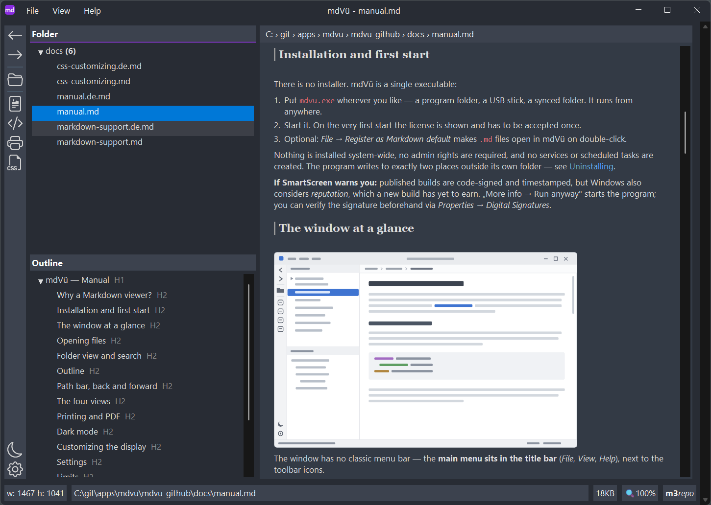

# mdVü — Manual

Markdown viewer for Windows · © 2026 Martin Niedergesäß — m3Works · *[Deutsche Version](manual.de.md)*

---

This is the extended manual for readers who want the whole picture, including installation, settings and troubleshooting. A shorter version ships inside the program — press `F1`.

**Contents**

- [Why a Markdown viewer?](#why-a-markdown-viewer)
- [Installation and first start](#installation-and-first-start)
- [The window at a glance](#the-window-at-a-glance)
- [Opening files](#opening-files)
- [Folder view and search](#folder-view-and-search)
- [Outline](#outline)
- [Reading with the keyboard](#reading-with-the-keyboard)
- [Path bar, back and forward](#path-bar-back-and-forward)
- [The four views](#the-four-views)
- [Printing and PDF](#printing-and-pdf)
- [Dark mode](#dark-mode)
- [Customizing the display](#customizing-the-display)
- [Settings](#settings)
- [Limits](#limits)
- [Keyboard shortcuts](#keyboard-shortcuts)
- [Command line](#command-line)
- [Troubleshooting](#troubleshooting)
- [Uninstalling](#uninstalling)

## Why a Markdown viewer?

There are excellent Markdown *editors* — Obsidian, Typora, VS Code and many more. So why a viewer?

Because reading is not writing. If you just want to look up a note, skim a document or simply *view* an `.md` file someone sent you, you don't need an editor with plugins, vaults and sync — you need a program that starts instantly, shows the file and gets out of your way.

That's exactly what mdVü is built for:

- **Lean:** a single EXE under 15 MB, no frameworks or runtimes to install.
- **Fast:** a native Windows application with its own rendering engine. Even large documents open without noticeable delay.
- **Light on memory:** uses a fraction of the RAM of Chromium-based editors, which ship a complete browser with every window.
- **A companion, not a replacement:** mdVü doesn't try to displace Obsidian & co. It's the tool for the quick look — double-click a file in Explorer, read, done. Your editor stays in charge of writing.

## Installation and first start

There is no installer. mdVü is a single executable:

1. Put `mdvu.exe` wherever you like — a program folder, a USB stick, a synced folder. It runs from anywhere.
2. Start it. On the very first start the license is shown and has to be accepted once.
3. Optional: *File → Register as Markdown default* makes `.md` files open in mdVü on double-click.

Nothing is installed system-wide, no admin rights are required, and no services or scheduled tasks are created. The program writes to exactly two places outside its own folder — see [Uninstalling](#uninstalling).

**If SmartScreen warns you:** published builds are code-signed and timestamped, but Windows also considers *reputation*, which a new build has yet to earn. „More info → Run anyway" starts the program; you can verify the signature beforehand via *Properties → Digital Signatures*.

## The window at a glance



The window has no classic menu bar — the **main menu sits in the title bar** (*File*, *View*, *Help*), next to the toolbar icons.

Below that, the window is split:

- **left, top:** the **folder view** — the current folder as a tree, `.md` files only
- **left, bottom:** the **outline** of the open document — all headings as a tree
- **right, top:** the **path bar** with the location of the current file
- **right, centre:** the **document**
- **bottom:** the status bar with document information and notices, and where the file lives (Obsidian vault, Git repository)

`F6` cycles the keyboard focus between the panes.

## Opening files

There are several ways to open a file:

- **Drag & drop:** drop an `.md` file or a whole **folder** onto the window. A folder opens in the folder view. If you drop several things at once, a file takes precedence over a folder.
- **Open dialog** with `Ctrl+O`.
- **Folder view:** clicking a file in the folder tree on the left, or moving through the tree with the arrow keys, shows it right away — just a **peek**: it does not end up in the history (*Back*) or among the recent files, and the path bar shows its name in *italics*. `Enter` or a double-click opens the file for real and moves the focus into the document; clicking into the document or `F6` does the same for a peeked file. `Ctrl+Shift+E` takes you back to the folder view. A **folder** shows up as a page of its own: its subfolders and Markdown files with size, date and the first lines of each file. `Enter` (or clicking into the page) moves into it ready for the keyboard — the arrow keys go from link to link, `Enter` opens a file or subfolder.
- **Recently used:** the *File* menu lists recently opened files and folders. The **start page** (*File → Start page*) also shows the last five files.
- **Double-click in Explorer:** *File → Register as Markdown default* associates mdVü with `.md` files (per user, no admin rights required). Windows may ask once via "Open with" — see [Troubleshooting](#troubleshooting).
- **Command line:** `mdvu.exe "C:\Notes\Readme.md"` — see [Command line](#command-line).

If the displayed file is changed by another program, mdVü reloads it automatically — the scroll position is preserved. `F5` does the same manually. Files that appear in or disappear from the current folder show up in the tree without a manual refresh; this works recursively, for subfolders too.

Very large files are loaded up to a limit of **50 MB** — a banner at the top of the document indicates that only the beginning is shown. See [Limits](#limits).

## Folder view and search

The folder view shows the folder of the current document, filtered to `*.md`. It is not a vault and not a workspace: it's simply the folder you are in, and it follows you as you navigate. Inside an Obsidian vault or a Git repository the tree shows all subfolders; elsewhere it goes two levels deep, so that opening something like `C:\` doesn't scan the whole drive.

**Recently changed.** A coloured dot behind a file shows how long ago it was changed — red within 10 minutes, orange within an hour, yellow within a day, grey within a week. A folder shows the dot of the most recently changed file inside it, even when it is collapsed. The dots update while mdVü is open, also for changes made by other programs, and a file that has just been changed or added lights up briefly. The clock ⏱ in the header of the folder view filters the tree: show only files changed in the last 10 minutes, 30 minutes, hour, day or week. The filter stays on while you search the folder view or open another folder; it is not kept for the next start.

`Ctrl+F` opens the search strip for the main pane — the view currently showing: document, source text, CSS or print preview. `F3` and `Shift+F3` step to the next and previous hit in the main pane, wherever the focus is: in the search field, in the document, even in the folder view or the outline. So you can keep reading and press `F3` to move on.

`Ctrl+F3` searches wherever you are — the pane holding the keyboard focus gets the strip. It is the only way to reach the folder view and the outline, and unlike `Ctrl+F` it also switches the strip off again.

In the **folder view** and the **outline** the strip appears above the tree. As you type, the tree is filtered — to matching files or headings — and hits are highlighted. The arrow-down key moves the focus from the search field into the tree, so you can type, then browse without touching the mouse. When you close the strip, the tree is expanded the way it was before the search.

In the **document, source text, CSS editor and print preview** the strip appears below the path bar and works like a browser's find bar: `Enter` and `Shift+Enter` step through the hits (in the document, a further `Enter` moves into the text instead — see *Reading with the keyboard*), a counter shows *hit / total*, and all hits are highlighted at once. Three toggles refine the search:

| Toggle | Meaning |
|---|---|
| `Aa` | Match case (off by default) |
| `.*` | Read the search term as a regular expression |
| `Sel` | Restrict the search to the current selection (document only; needs a non-empty selection) |

In the **document**, mdVü always searches the whole text — including parts of very large files that haven't been displayed yet; it finds what you see (`foo` also matches `**fo**o`, but not a link address). While you type, mdVü waits until you pause briefly (0.3 seconds) and until you've entered **3 characters**, so typing stays smooth even in large documents. `Enter` and `F3` search right away, shorter terms too. A term in quotes (`"ab"`) searches for exactly that text, even if it is short or has spaces at the edges. With a very large number of hits, the first 10,000 are highlighted; the status bar tells you.

`Ctrl+F3` again, `Esc` or the `X` button closes the strip — highlights disappear, the folder filter is lifted. The search term itself is kept: `Ctrl+F` brings it back into the field, and `F3` resumes the search from the first hit. That also means `F3` can leave highlights in the document without a visible strip; `Esc` in the document clears them.

Only one strip is open at a time; switching views closes the main pane's strip (the strips above the trees stay).

Note on the print preview: it searches what has actually been paginated. Documents cut off at the 200-page limit end there for the search as well.

## Search in files

`Ctrl+Shift+F` opens a strip that searches **all Markdown files** of an area at once. Next to the search field you pick the area:

| Area | What it covers |
|---|---|
| Vault | the Obsidian vault of the current document |
| Repository | the Git repository of the current document |
| Folder | the folder shown in the folder view, with all subfolders |
| All favorites | every folder among your favorites at once; the hits are grouped by favorite |

The narrowest area is preselected — inside a vault the vault, inside a repository the repository, otherwise the folder. Selected text or the term of a running document search is filled in. `Enter` starts the search; once the result list for exactly this search is showing, `Enter` moves the focus into the list instead (`F5` searches again). `↓` always ends up in the list — if the term or the options have changed since, it searches first, so you never land in stale results. `Aa` matches case; a term in quotes (`"ab"`) searches for exactly that text. Two more toggles set word boundaries — only one of them can be on:

| Toggle | Meaning |
|---|---|
| `ab…` | Beginning of a word, also after a hyphen or punctuation: `der` finds *derzeit* and *Nord-der*, but not *oder* |
| `\|ab\|` | Whole words only |

There is no search-as-you-type here: a search across thousands of files only starts when you ask for it.

The result is a **document of its own**, with its own place in the history:

- files whose **name** matches come first, even without a hit in the text;
- then the hits, grouped by folder — each file with its number of hits and up to three lines of context, the hit highlighted;
- clicking a file name opens the file at its first hit, clicking a line number opens it at exactly that hit. The document search is already filled in there, so `F3` walks on through the file. The list opens ready for the keyboard: arrow keys or `Tab` move between the hit links, `Enter` opens one (see *Reading with the keyboard*).

**Back** (`Alt+←`) returns to the result list at the place you left. The list is kept — the last five result lists are held in memory — so it looks exactly as before, even if files have changed since. `F5` on the result list searches again. Because the list is a document, you can search in it (`Ctrl+F`), print it or save it as PDF, and its outline lists the folders and files.

Large folders are searched in the background: the list grows while you read, and the footer shows the progress. Opening another document stops a running search; going back to it then searches again. Files larger than the load limit (`doc/maxLoadMB`) are searched up to that limit, like the display; the list marks them.

mdVü searches **the text you see** — in files exactly as in the document, so both count the same hits: front matter (properties) is included and marked as such in the list, but `%%comments%%`, link targets and Markdown markup are not. Obsidian's own search does find comments. Hidden folders (starting with a dot, like `.obsidian` or `.git`) are skipped, and only `*.md` files are searched.

## Outline

Below the folder view, mdVü shows the **outline** of the current document — all headings as a tree, nested by level. A click jumps to that position in the document; the target flashes briefly so your eye finds it right away. Like the folder view, a click or the arrow keys only peek; `Enter` or a double-click makes the jump part of the history, so *Back* returns to that chapter.

For a long document, the outline is the fastest way around: no scrolling, no searching, one click. With very many headings, press `Ctrl+F3` with the focus in the outline: the strip filters it to the headings containing the search text — together with their parent headings, so you can see where they are.

## Reading with the keyboard

mdVü is a reader, so the document doesn't need a text cursor all the time — the keys are free for moving through it in **units**, much like a browser lets you tab through links. The footer always shows the active unit:

| Key | Unit | Footer | Arrow keys |
|---|---|---|---|
| `0` | Scroll | `SCROLL` | scroll like in a browser, as do `Page Up`/`Page Down` and `Home`/`End` (default) |
| `1` | Caret | `CARET` | move a text cursor by character and line, as after a click into the text |
| `L` | Links | `LINK 3/41` | `←`/`→` previous/next link in reading order, `↑`/`↓` nearest link in the line above/below |
| `H` | Hits | `HIT 2/17` | walk through the hits of the document search (`Ctrl+F`) |

A click on the unit in the footer opens a menu with all units.

`F7` switches between scrolling and the caret (as *caret browsing* does in browsers). `Tab` and `Shift+Tab` always go to the next/previous link, whatever unit is active, and `Enter` follows the active link — or the link at the caret. The first link is the first one **on screen**, not the first one in the document; the active link is highlighted (CSS: `highlight.nav`). `↑`/`↓` really move vertically: they skip the other links of the same line and go to the closest link in the next line above or below that has one.

The way in from the search: in the document search strip, the first `Enter` searches, every further `Enter` — and `↓` at any time — puts the focus into the document with the unit *Hits*, so `←`/`→` continue through the hits. The result list of *Search in files* opens with the unit *Links*: as soon as you move into it, the first link on screen is highlighted and `Enter` opens it. The highlight stays on its target while a large search is still adding results.

A click into the text switches to the caret. `Esc` steps back the way you came: from links or hits into the field of the open search strip (document search or search in files) — a second `Esc` there closes the strip and returns you to the document in scroll mode — and without a strip straight to scrolling. The unit belongs to the place in the history: **Back** brings it back, including the active link. Keys `2` to `5` are reserved for words, sentences, paragraphs and headings. Links work in very large documents too, also in parts that haven't been displayed yet.

## Favorites

Folders you return to often — your vaults, your repositories — can be kept as **favorites**. `Ctrl+D` adds the folder shown in the folder view, or removes it again; the **star** in the toolbar is filled when the current folder is a favorite. Clicking the star (or `Ctrl+Shift+D`) opens the list: arrow keys and `Enter` open a favorite, `Del` removes the selected one. The favorites also appear in the **File** menu, and the menu of a file or folder (right-click in the folder view) adds or removes them. Search in files can search **all favorites** at once. mdVü keeps them in `favorites.yaml` next to its other settings.

## Path bar, back and forward

Above the document, the **path bar** shows the location of the current file. Every segment is clickable: clicking a folder opens it in the folder view.

**The file's own menu.** Clicking the file path in the status bar opens a menu for that file: copy the path, show it in Explorer, open it in Obsidian (inside a vault) or with another program installed for `.md` files. Right-clicking a file or folder in the folder view, or the **Obs**/**Git** badge in the status bar, opens the same menu — in the folder view also by keyboard with `Shift+F10` or the context-menu key.

mdVü navigates its history like a browser: the arrow icons in the toolbar or `Alt+←` / `Alt+→` step back and forward. **Right-clicking the arrows** opens the history list, so you can jump straight to any earlier document instead of stepping through them.

**Back takes you to where you were** — not to the top of the document. mdVü remembers the topmost visible line of text rather than a pixel position, so this still fits when the window width or zoom has changed in the meantime or the document is loaded in pieces. If the file has become shorter, you land at its end. A running search in the document comes back too: search term, options, active hit and the strip. If you closed the search with `Esc` before moving on, it won't come back either.

Links inside documents work as you'd expect: a relative link to another `.md` file opens that file; a link to a heading (`#section`) jumps within the document; an `http(s)` link opens in your browser after a confirmation. Links that lead nowhere sensible are refused rather than followed. A link of the form `mdvu:open?uri=…&find=…` or `&mark=…` opens a document and highlights matches or lines in it — see [Linking to places](markdown-support.md#linking-to-places).

## The four views

The document area holds four interchangeable views:

| View | Shortcut | What it's for |
|---|---|---|
| **Markdown** | `Ctrl+1` | the rendered document — the normal view |
| **Source** | `Ctrl+2` | the raw Markdown text, syntax-highlighted, read-only |
| **CSS** | `Ctrl+4` | your own stylesheet, see [Customizing the display](#customizing-the-display) |
| **Print preview** | `Ctrl+F2` or `Ctrl+3` | the paginated document as it will print |

Switching back from CSS to the Markdown view applies your changed stylesheet immediately.

## Printing and PDF

mdVü comes with its own print and PDF output — no detour through a browser or a PDF printer driver:

- **Print preview** (`Ctrl+F2`): even for long documents, 100 pages are ready in a few seconds.
- **Page setup:** a strip at the top of the print preview selects the printer, the paper size (A3, A4, A5, A6, Letter, Legal) and portrait or landscape. The preview is laid out anew right away, and print and PDF use exactly this format — what you see in the preview is what comes out of the printer. *Printer setup…* opens the Windows printer settings without printing; printer, paper size and orientation chosen there are taken over. Show or hide the strip with `Ctrl+Shift+P` (*View → Page setup*), close it with `Esc`. The choice is remembered. Paper sizes outside the list above are not supported yet; if the printer dialog returns one, mdVü keeps the size set in the strip.
- **Native PDF:** *View → Export as PDF* produces a true vector PDF with selectable text and a PDF outline built from the document's headings. The files are usually smaller than "Print to PDF" via a printer driver.
- **Clean page breaks:** orphaned lines are taken into account — a single line of a paragraph is never left alone at the top or bottom of a page.
- **Wide tables** are fitted automatically: the font shrinks moderately (down to 70 %), anything still wider is cut off at the right page edge — so put the important columns first. Long-text columns are capped at 30 % of the page width when space is tight. The previous behaviour (squeeze all columns onto the page) is available via the setting `print/tableFit = squeeze`.
- **Print** straight from the view with `Ctrl+P`. The print dialog starts with the printer and paper from the page setup, and changes made there flow back into the preview.

Print and PDF output is always light, regardless of the dark mode setting — a dark page background would waste toner and read badly on paper. Preview, print and PDF are limited to the first **200 pages**; a note appears in the status bar when a document is cut off.

## Line breaks, Obsidian and Git

By default, mdVü follows the Markdown standard (CommonMark): a single line break inside a paragraph becomes a space. A line only breaks where it ends with two spaces or a backslash `\`. Apps like Typora and Obsidian break at every line instead.

If a file lies in an **Obsidian vault** (a folder containing `.obsidian`), mdVü uses the vault's setting *Strict line breaks*, so the note looks the way it does in Obsidian. For all other files, `doc/lineBreaks = newline` in `settings.ini` switches to one line, one break.

The status bar shows where a file lives: **Obs** for an Obsidian vault, **Git** for a Git repository, **Obs/Git** if both share the same folder. A click opens that folder in the folder view.

**Wikilinks** such as `[[Note]]` and embeds such as `![[picture.png]]` are resolved inside a vault the way Obsidian does it: by name, anywhere in the vault. `[[Note#Heading]]` opens the note and jumps to the heading — so does a Markdown link like `[details](note.md#installation)`. See [Markdown support](markdown-support.md#wikilinks) for the details.

## Dark mode

*View → Dark Mode* switches the whole UI including the document. The setting is remembered.

Dark mode in the document is entirely CSS-driven: the built-in dark stylesheet is layered on top of the light one. This matters when you write your own CSS — see [Customizing with CSS](css-customizing.md), which explains why a colour you set only for dark mode can "stick" when you switch back.

## Customizing the display

*View → CSS* (`Ctrl+4`) opens your own stylesheet, which is applied on top of the built-in defaults. Use it to adjust things like font, font size, colours and spacing. The file (`user.css`) lives in the settings folder and survives updates.

On first start it is pre-filled with a comment and one line:

```css
@import "builtin:default.css";
```

That line is the switch for the built-in design. Keep it and your rules are layered on top of the defaults. Delete it from a non-empty `user.css` and mdVü loads neither the default stylesheet nor its dark counterpart — you are designing from scratch.

Good to know: mdVü deliberately supports only a **subset** of CSS — not everything a browser can do with HTML5. The scope is intentionally kept small; that's exactly where mdVü's speed and low memory footprint come from. Tip: specify font sizes in `pt` so the display scales cleanly with screen DPI.

The full reference with worked examples is in [Customizing with CSS](css-customizing.md).

## Settings

There is no settings dialog yet. *Help → Setting* opens a small note with a clickable link to the settings folder:

```
%APPDATA%\m3Works\mdVu
```

It contains `settings.ini` (values), `user.css` (your stylesheet) and `favorites.yaml` (your favorites). Values are written through immediately — mdVü never loses a setting on a crash, but it also means **you should close the program before editing `settings.ini` by hand**, otherwise your changes will be overwritten.

Keys are hierarchical: everything before the slash is the INI section, everything after is the key name. `doc/maxLoadMB = 80` therefore looks like this in the file:

```ini
[doc]
maxLoadMB=80
```

The values worth knowing about:

| Key | Meaning |
|---|---|
| `doc/maxLoadMB` | load limit for a single document in MB (default 50) |
| `doc/zoom` | document zoom in percent (default 100); the closest step applies — written when you zoom |
| `doc/lineBreaks` | line breaks outside an Obsidian vault: `standard` (default, Markdown standard) or `newline` (every line break breaks, as in Typora). Inside a vault, the vault's own setting applies. Takes effect on the next start |
| `print/paper` | paper size: `A3`, `A4` (default), `A5`, `A6`, `Letter`, `Legal` — written by the page setup strip |
| `print/orientation` | `portrait` (default) or `landscape` |
| `print/printer` | printer name; empty means the Windows default printer |
| `print/tableFit` | how wide tables are fitted: `shrink` (default) or `squeeze` |
| `print/tableMaxColPct` | maximum width of a long-text column in percent of the page (default 30) |
| `print/tableMinFontPct` | how far the font may shrink when fitting, in percent (default 70) |
| `ui/theme`, `ui/mode` | named stylesheet and light/dark/system — written by the Dark Mode command |
| `ui/currentFolder` | folder restored on the next start |
| `ui/pageSetupBar` | show the page setup strip in the print preview (on by default) |
| `ui/fileMru`, `ui/folderMru` | recently used files and folders |
| `ui/resizeBudgetMs`, `ui/resizeSettleMs`, `ui/resizeRefreshMs` | timing of the re-layout while a window is being resized |

## Limits

mdVü has a few deliberate hard limits. They exist so that an unusual file cannot freeze the program:

| Limit | Value | What happens |
|---|---|---|
| File size | 50 MB | only the beginning is displayed, with a yellow banner at the top; adjustable via `doc/maxLoadMB` |
| Pages in preview / print / PDF | 200 | output is cut off, with a note in the status bar |
| Single paragraph | 100 KB | an over-long paragraph is split (this affects generated files, not hand-written prose) |
| Search in files | 500 files | the result list stops there, with a note to narrow the search |
| Folder view depth | 2 levels below the opened folder | deeper folders are not shown; no limit inside an Obsidian vault or a Git repository |

## Keyboard shortcuts

| Key | Function |
|---|---|
| `Ctrl+O` | Open file |
| `F1` | Manual |
| `Ctrl+F` | Search in the main pane |
| `F3` / `Shift+F3` | Next / previous hit in the main pane |
| `Ctrl+F3` | Search in the focused pane on/off (incl. folder view and outline) |
| `Ctrl+Shift+F` | Search in files (vault, repository or folder) |
| `Esc` | Close the search strip / clear the highlights / back to scrolling |
| `0` / `1` / `F7` | Document: scroll / caret / switch between them |
| `L` / `H` | Document: walk through links / search hits with the arrow keys |
| `Tab` / `Shift+Tab` | Document: next / previous link |
| `Enter` | Document: follow the active link |
| `Ctrl+C` | Document: copy the selection — as text, and with formatting for Word, Outlook & Co. Images go along as links to the original files (in their original format); Word embeds them when pasting |
| `Ctrl+Shift+C` | Document: copy the selection as Markdown |
| Right mouse button | Document: menu with Copy, Copy as Markdown, Back and Forward |
| `Ctrl+mouse wheel` | Document: zoom (50–200 %). A click on the zoom value in the footer offers all steps; the zoom is kept for the next start |
| `F5` | Reload document / search again on the result list |
| `F6` | Switch between panes (tree / document / editor) |
| `Ctrl+Shift+E` | Go to the folder view |
| `Alt+←` / `Alt+→` | Back / forward |
| `F10` / `Alt` | Menu bar by keyboard: `←`/`→` choose a menu, `Enter` opens it, `↑`/`↓` + `Enter` run an entry, a letter jumps to it, `Esc` steps back. `Alt`+initial letter opens a menu directly |
| `Ctrl+D` | Add/remove the current folder as favorite |
| `Ctrl+Shift+D` | Show favorites |
| `Ctrl+1` | Markdown view |
| `Ctrl+2` | Source view |
| `Ctrl+3` / `Ctrl+F2` | Print preview |
| `Ctrl+4` | Edit CSS |
| `Ctrl+P` | Print |
| `Ctrl+Shift+P` | Page setup strip in the print preview on/off |

## Command line

```
mdvu.exe "C:\Notes\Readme.md"     open a file
mdvu.exe "C:\Notes"               open a folder
mdvu.exe -accepteula              accept the license non-interactively
```

The first parameter may be a file or a folder; a file is opened, a folder shown in the folder view. This is also the mechanism behind the Explorer file association.

`-accepteula` is meant for unattended setups where the first-start dialog would be in the way — it records the acknowledgement exactly as clicking *Accept* would.

## Troubleshooting

**Double-clicking an `.md` file still opens the old program.**
Windows keeps its own user choice for file types, which takes precedence over an application's registration. Right-click the file → *Open with* → *Choose another app* → mdVü → *Always*. After that the association sticks.

**A picture in the document isn't shown.**
mdVü resolves relative image paths against the document's own location, so a picture must be reachable from there. Images from the internet are not fetched — the program has no network access at all. Supported formats are the usual Windows ones (PNG, JPEG, GIF, BMP, TIFF, SVG); an unreadable file is skipped rather than reported.

**My CSS rule has no effect.**
The most common causes are: a unit the engine cannot resolve (use `pt`, `px`, `mm`, `cm` or `in` — *not* `em` or `%` for sizes), a selector for something the document doesn't produce, or the `@import` line having been removed from `user.css`. The [CSS documentation](css-customizing.md) has a checklist for exactly this.

**The document looks fine on screen but wrong on paper.**
Print, preview and PDF use a separate stylesheet and are always light. Rules that only exist in your dark-mode block have no effect there.

**The window is dark but the document stayed white** (or vice versa).
Switch dark mode off and on again. If it persists, it's worth reporting — please mention whether it happened right after the first start.

**The program crashed.**
mdVü writes `mdvu.crash.log` next to the executable. If that folder is read-only (for example below *Program Files*), the file goes to `%LOCALAPPDATA%` instead — type that into the Explorer address bar to get there. The file contains the error location and a stack dump, no document content. Nothing is sent anywhere — mailing it in is entirely your decision, and it makes fixing the bug much more likely.

## Uninstalling

Delete `mdvu.exe`. Optionally also:

- the settings folder `%APPDATA%\m3Works\mdVu` (settings and your `user.css`)
- the registry key `HKCU\Software\m3Works\mdVu` (the license acknowledgement)
- the file association, via *File → Remove Markdown registration* **before** deleting the EXE

That's everything mdVü ever touches.

---

*mdVü is in beta. The program is provided free of charge and "AS IS"; no warranty is given for freedom from defects or fitness for a particular purpose. See [LICENSE](../LICENSE.md).*
