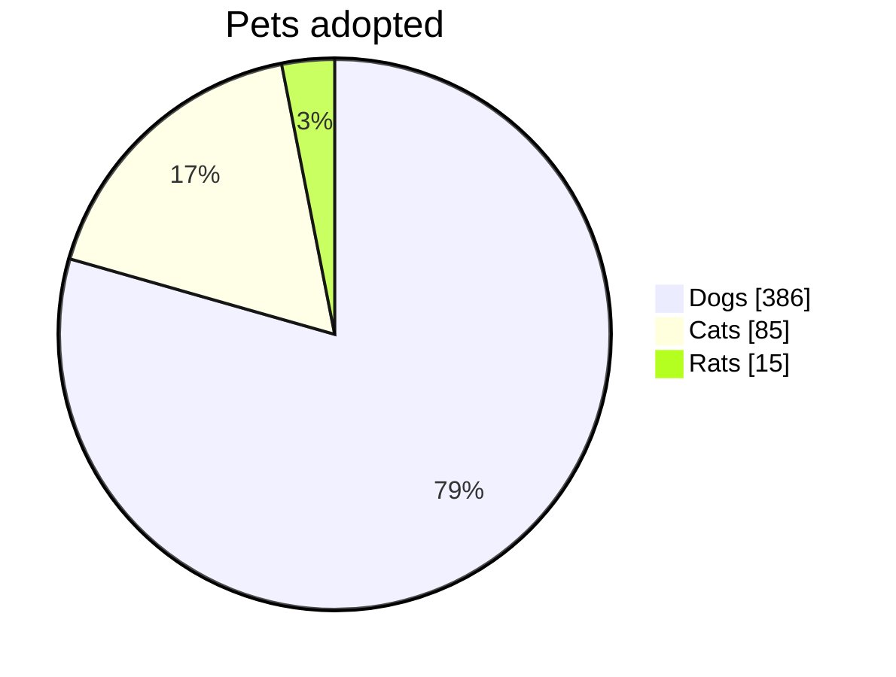
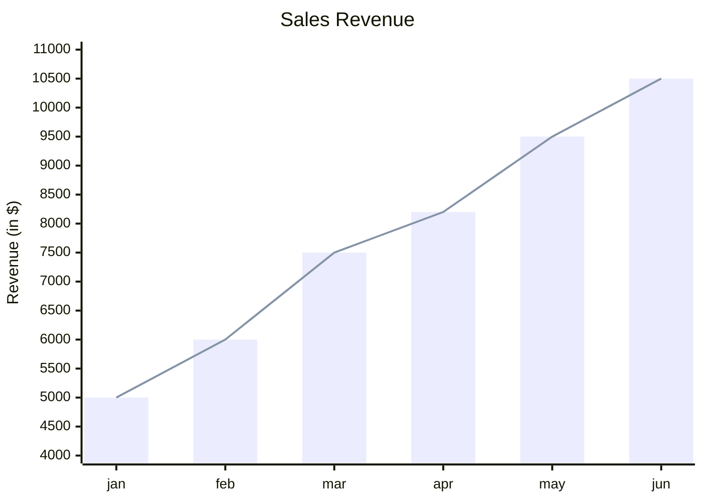
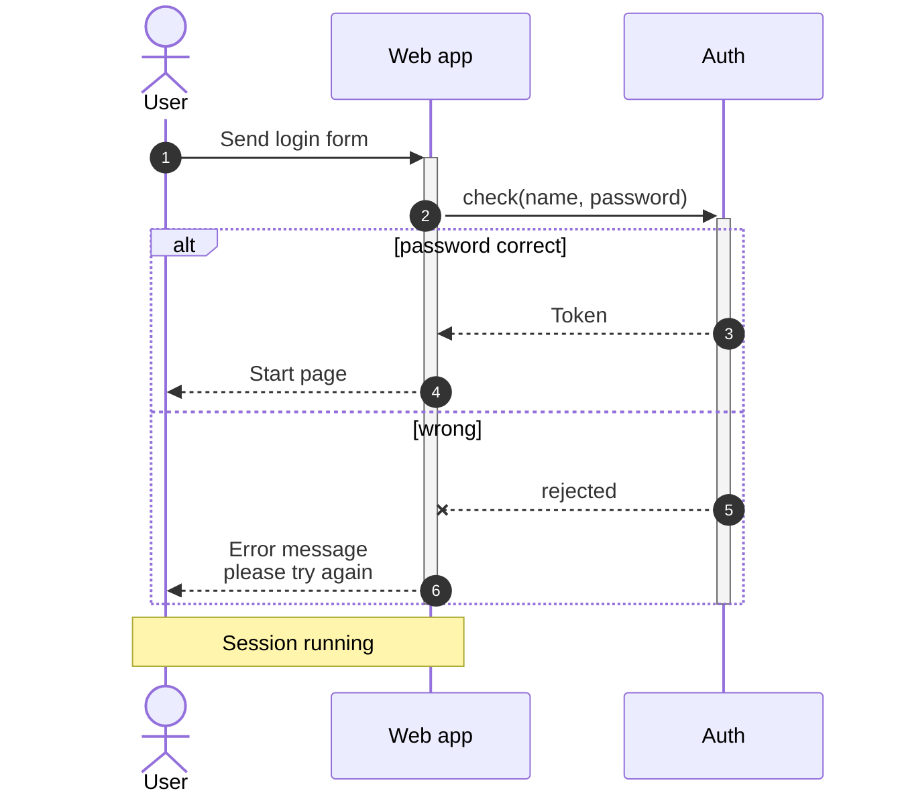
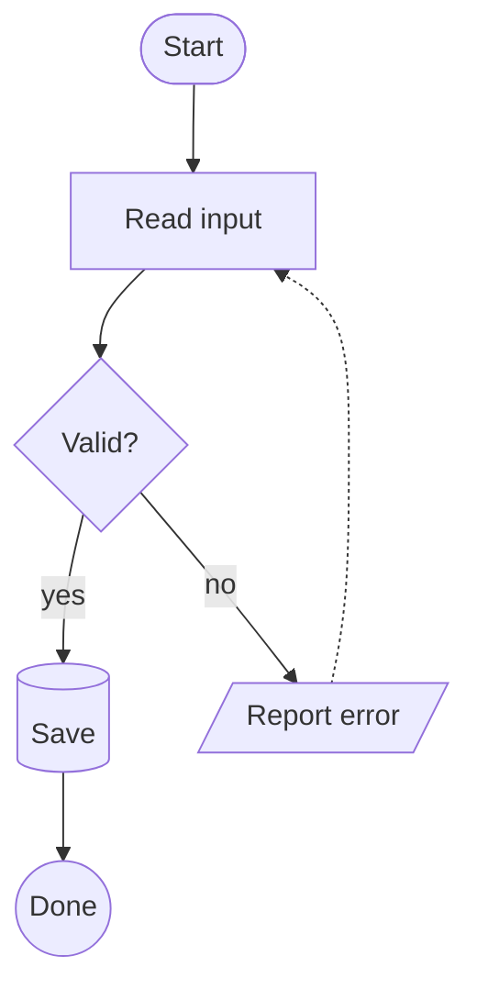

# Markdown support

*[Deutsche Version](markdown-support.de.md)*

mdVü reads **GitHub-flavoured Markdown (GFM)**, plus the two Obsidian extensions that matter most for reading notes: callouts and wikilinks. This page lists what is actually rendered, what is rendered *differently* than in a browser, and what is deliberately left out.

The philosophy behind the omissions: mdVü renders Markdown directly into a layout tree — there is no HTML, no browser, no DOM in between. That's where the speed and the small memory footprint come from, and it's also why a handful of browser-only features don't exist here.

Want to see it all at once? Open [`samples/showcase.md`](../samples/showcase.md) in mdVü.

## Block elements

| Syntax | Notes |
|---|---|
| `# Heading` … `###### Heading` | six levels |
| `Heading` + `=====` / `-----` | Setext headings work too |
| Paragraphs | a blank line separates them |
| Two spaces or `\` at end of line | hard line break inside a paragraph |
| `- item`, `* item`, `+ item` | unordered lists, nestable |
| `1. item`, `1) item` | ordered lists; the first number is respected, so a list may start at 5 |
| `- [ ] todo`, `- [x] done` | task lists with checkboxes |
| `> quote` | block quotes, nestable |
| `> [!note] Title` | callouts — see below |
| ` ```lang … ``` ` | fenced code blocks with syntax highlighting; `~~~` works as a fence too |
| ` ```mermaid … ``` ` | pie, bar/line and sequence diagrams and flowcharts — see [Charts](#charts-mermaid-subset) |
| four leading spaces | indented code block |
| `\| a \| b \|` + `\|---\|---\|` | GFM tables — see below |
| `---`, `***`, `___` | horizontal rule |
| `---` … `---` at the top of the file | YAML front matter — see below |

## Inline elements

| Syntax | Result |
|---|---|
| `*italic*`, `_italic_` | *italic* |
| `**bold**`, `__bold__` | **bold** |
| `***both***` | nesting works in any combination |
| `~~struck~~` | struck through, with a real strike line |
| `==highlighted==` | highlighted like a text marker — see [Highlights](#highlights) |
| `<u>underlined</u>` | underlined — Markdown has no syntax of its own for it |
| `` `code` `` | inline code, in its own colour |
| `[text](url)`, `[text](url "title")` | link |
| `<https://example.com>` | autolink |
| `https://example.com`, `www.example.com` | bare URLs are linked as well |
| `` | image — see below |
| `[[Target]]`, `[[Target\|Alias]]` | wikilink |
| `![[picture.png]]` | image embed |
| 🎉 emoji | rendered in colour, not as a monochrome outline |
| `<kbd>Ctrl</kbd>`, `<span class="…">` | a few HTML formatting tags — see [Inline HTML](#inline-html) |

Emphasis is parsed tolerantly: an unbalanced `**bold with no end` stays plain text instead of swallowing the rest of the paragraph.

## Highlights

```markdown
This is ==important== and this is ==**very** important==.
```

`==text==` highlights like in Obsidian — in every document, not only inside a vault. The marks have to hug the text: in `a == b` the equals signs stay what they are. Formatting inside a highlight works, and a link inside one keeps its link colour. A highlight that runs across a line break continues on the next line without a seam.

Out of the box the highlight is a light yellow, in dark mode a muted one; it is printed and exported to PDF as well. Your `user.css` can change it — see [Highlights, keys and your own classes](css-customizing.md#highlights-keys-and-your-own-classes).

## Inline HTML

mdVü has no HTML engine, but it understands a short list of formatting tags inside the text:

| Tag | Result |
|---|---|
| `<u>…</u>` | underlined |
| `<mark>…</mark>` | highlighted, same as `==…==` |
| `<s>…</s>`, `<del>…</del>` | struck through, same as `~~…~~` |
| `<b>…</b>`, `<strong>…</strong>` | bold |
| `<i>…</i>`, `<em>…</em>` | italic |
| `<kbd>…</kbd>` | a key cap: monospaced, with a light frame |
| `<span class="name">…</span>` | no look of its own — give it one with `span.name { … }` in your `user.css` |
| `<br>`, `<br/>`, `<br />` | a line break — the only way to get one inside a table cell |

Markdown inside these tags keeps working (`<u>*both*</u>`). Upper and lower case don't matter. The only attribute that counts is `class`; `style="…"` and all others are ignored. A tag that is never closed lasts until the end of the paragraph; a closing tag without an opening one stays visible as text. Every other tag is shown as literal text.

## Tables

```markdown
| Left | Centre | Right |
|:-----|:------:|------:|
| a    |   b    |     c |
```

- The alignment row (`:---`, `:---:`, `---:`) is honoured, on screen and in print.
- A table **needs a header row**. Rows without a valid `|---|` separator line stay a paragraph — that's GFM behaviour, and it stops accidental pipe characters from turning prose into a table.
- Ragged rows are tolerated: too few cells are padded, extra ones dropped, based on the header's column count.
- Cells hold inline markup (bold, code, links), not block elements. A `<br>` starts a new line within the cell.
- Very wide tables are automatically fitted when printing — see the [manual](manual.md#printing-and-pdf).

## Links and anchors

- **Relative links** (`[Manual](manual.md)`) are resolved against the folder of the current document and open that file in mdVü.
- **Anchors** (`[to the section](#tables)`) jump inside the document. The anchor name is derived from the heading: lower-cased, spaces become hyphens, hyphens and underscores are kept, everything else (punctuation, symbols) is dropped. `## Links and anchors` therefore becomes `#links-and-anchors`. Duplicate headings are numbered: `#notes`, `#notes-1`, `#notes-2`. This matches the convention GitHub uses, so the same link usually works in both places.
- **Anchors into other documents** (`[details](other.md#installation)`) open the document and jump to the heading. After the `#` you can use the anchor name (as above) or the heading's text. Percent-encoded links, as Obsidian writes them with wikilinks turned off (`[x](My%20Note.md#My%20Section)`), work too. If the link points to the document that is already open, mdVü just jumps. If the section doesn't exist, the document opens at the top and the status bar tells you.
- **`http(s)` links** open in your default browser after a confirmation.
- Links to anything else are refused rather than followed. mdVü never opens an executable or a shell command from a document.

Anchors and the outline also find their target in very large documents that are loaded in chunks, even if it hasn't been loaded yet. A `#` in a file name must be written as `%23` in the link — otherwise everything after it counts as the anchor.

**Links to missing files** are shown paler than other links, like Obsidian's unresolved links — for relative links and wikilinks alike. They stay clickable. A link to a missing *section* of an existing file is not marked, as in Obsidian. The colour comes from `a.unresolved` in your `user.css` — see [Selectors](css-customizing.md#selectors).

## Linking to places

A link to `mdvu:open` opens a document and brings highlights or a search along — meant for notes, lists of matches and tools that want to point at particular spots in other files:

```
[All invoices](mdvu:open?uri=C:/Notes/plan.md&find=invoice)
[The third match, whole word](mdvu:open?uri=C:/Notes/plan.md&find=invoice&word&hit=3)
[Lines 40–42 as a warning](mdvu:open?uri=C:/src/README.md&mark=12:5-20&mark=40-42~warn)
[Highlight plus section](mdvu:open?uri=C:/Notes/plan.md&mark=7~ffcc00#Goals)
```

`uri=` is the full path of the file with `/` instead of `\`; spaces and other special characters are percent-encoded (`%20`, `&` as `%26`). Such links work inside documents — the command line only takes files and folders.

**`find=` — highlight every match, like the search.** mdVü searches the whole document, highlights all hits and shows the search strip with the term; `F3` and `Shift+F3` move on, `Esc` clears.

| Addition | Meaning |
|---|---|
| `&case` | match case |
| `&word` | whole words only |
| `&regex` | read the search text as a regular expression (without regex support in the program, mdVü searches for the plain text; the status bar tells you) |
| `&hit=3` | the third hit is the active one (default: the first) |
| `find=TODO~todo` | colour of the highlight (see below) |

**`mark=` — highlight lines or ranges**, as often as you like. The positions refer to the file's **source text**, as an editor or `grep` shows it; lines and columns count from 1, the end is exclusive:

| Position | Range |
|---|---|
| `12` | the whole of line 12 |
| `12-14` | lines 12 to 14 |
| `12:5-20` | line 12, column 5 up to column 20 |
| `12:5-14:3` | from line 12, column 5 up to line 14, column 3 |
| `12:5` | jump target only, no highlight |

Markup that isn't visible (`**`, link addresses, comments) is left out. Ranges beyond the end of the file are dropped; if all of them are, the status bar tells you. At most 1000 `mark` per link.

**Colours:** `~` followed by either a class — `warn`, `error`, `ok`, `info`, `find` — or a colour as six hex digits **without** `#` (`~ffcc00`; in a link, `#` already starts the section). Without it, `mark` uses yellow and `find` the search colour. The classes are style rules in the document CSS and can be recoloured or extended in `user.css`, e.g. `highlight.todo { background-color: #a0e0ff; }`.

**Where it jumps:** to the section after `#`, otherwise to the first `mark`, otherwise to the active `find` hit — everything is highlighted either way. When you go back, the place you last were wins. `Esc` in the document clears the highlights.

## Images

```markdown

      width 620
  width 620, height 400
![[diagram.svg]]                         Obsidian embed
```

- Formats: PNG, JPEG, GIF, BMP, TIFF and SVG, plus `data:` URIs.
- **An image must be a paragraph of its own.** A picture in the middle of running text (`see  here`) is *not* rendered — only its alt text appears. Put it on its own line, separated by blank lines.
- Several images in one paragraph end up side by side; a hard line break between them puts them on separate rows. A link around an image works (`[](target.md)`).
- The size suffix `|width` / `|widthxheight` is the Obsidian convention. Given a width only, the height follows proportionally. Other Markdown tools show the suffix as part of the alt text — harmless, and the reason this manual uses it too.
- Paths are resolved relative to the document.
- **Images are never fetched from the internet** — mdVü has no network access at all. An `https://…` image source stays an alt text.
- Unreadable or missing files are skipped silently, leaving the alt text.

## Code blocks and syntax highlighting

Fenced blocks are highlighted when the fence names a language:

````markdown
```python
def answer() -> int:
    return 42
```
````

Recognized names (aliases in brackets):

| Language | Fence name |
|---|---|
| Pascal / Delphi | `pascal`, `delphi`, `pas`, `dpr` |
| C / C++ | `c`, `cpp`, `h`, `hpp`, `cc` |
| C# | `cs`, `csharp` |
| Java | `java` |
| JavaScript / TypeScript | `js`, `javascript`, `jsx`, `ts`, `typescript`, `tsx` |
| Python | `python`, `py` |
| Go | `go` |
| Rust | `rust`, `rs` |
| Kotlin / Swift / PHP | `kotlin`, `kt`, `swift`, `php` * |
| Lua | `lua` |
| Shell | `sh`, `bash`, `zsh`, `shell` |
| SQL | `sql`, `tsql`, `mysql`, `pgsql` |
| VB / VBScript | `vb`, `vbs`, `vbscript`, `basic` |
| CSS | `css` |
| Markdown | `markdown`, `md` |
| JSON | `json` |
| YAML | `yaml`, `yml` |
| INI / TOML | `ini`, `conf`, `cfg`, `toml`, `properties` |

\* For these three, comments, strings and numbers are highlighted, but keywords are not yet.

An unknown language is not a problem: the block simply stays in the plain code colour rather than being coloured wrongly. Highlighting distinguishes comments, strings, numbers, keywords and identifiers — the colours come from the stylesheet, so you can [change them](css-customizing.md#code-highlighting).

[`samples/code-samples.md`](../samples/code-samples.md) shows the highlighting for a dozen languages side by side.

## Charts (Mermaid subset)

mdVü draws four kinds of [Mermaid](https://mermaid.js.org/) diagrams itself: **pie charts**, **bar/line charts**, **sequence diagrams** and **flowcharts**. This is a deliberately slimmed-down implementation. mdVü has no JavaScript engine and does not run Mermaid; it reads a small part of Mermaid's syntax and draws the chart with its own layout engine. In return the charts open instantly, follow dark mode and your `user.css`, and stay sharp vector graphics in print and PDF.

````markdown



````

What is understood:

| Syntax | Notes |
|---|---|
| `pie`, `pie showData` | `showData` adds the values to the legend; the slices show percentages |
| `"Label" : 42.5` | one slice per line; numbers with a dot as decimal separator, no negative values |
| `xychart-beta`, `xychart-beta horizontal` | `horizontal` puts the categories on the left and the values along the bottom |
| `x-axis [a, b, "c d"]` | categories, title optional in front: `x-axis Month [jan, feb]` |
| `x-axis "Year" 2020 --> 2025` | a number range instead; the values are spread evenly across it |
| `y-axis "Title" 0 --> 100` | title and range are both optional — without a range mdVü picks round numbers |
| `bar [..]`, `line [..]` | as many as you like, in any mix; several bar series stand side by side, lines are drawn on top |
| `bar "Name" [..]` | **mdVü extension:** named series get a legend |
| `title …` | with or without quotes |
| `accTitle:`, `accDescr:` | used as the chart's alternative text |

Everything else is skipped without complaint: `%%{init: …}%%` configuration and themes, data labels, click handlers. Other diagram types — class, state and Gantt diagrams and so on — stay a code block. If a chart contains a mistake, the code block is shown with a short note below it naming the line.

The colours come from the stylesheet. Each series (or pie slice) has a class `series-1`, `series-2`, … ; further classes are `title`, `legend`, `axis-label`, `axis-title`, `grid`, `axis`, `line` and `slice-label`, and for sequence diagrams `actor`, `actor-label`, `lifeline`, `message`, `message-label`, `note`, `activation`, `frame` and `frame-label`, and for flowcharts `node`, `node-label`, `edge`, `edge-thick`, `edge-head`, `edge-label` and `edge-label-box`:

```css
.chart .series-1 { background-color: #2e7d32; }  /* first series / slice */
.chart .grid     { border-color: #dddddd; }
.chart .title    { font-size: 12pt; }
```

### Sequence diagrams



| Syntax | Notes |
|---|---|
| `participant A`, `actor A` | participants appear in the order of declaration, otherwise of first use; `as Name` sets the displayed name |
| `participant A@{ "type": "database" }` | symbols: `actor`, `boundary`, `control`, `entity`, `database`, `collections`, `queue`; `"alias": "…"` sets the name |
| `A->>B: text` | arrows `->`, `-->`, `->>`, `-->>`, `<<->>`, `<<-->>`, `-x`, `--x`, `-)`, `--)` — two dashes draw a dashed line |
| `A->>+B`, `B-->>-A`, `activate A`, `deactivate A` | activation bars, nestable |
| `Note left of A`, `right of`, `over A,B` | notes |
| `loop`, `alt`/`else`, `opt`, `par`/`and`, `critical`/`option`, `break` | frames with a label, nestable |
| `rect rgb(…)`, `box Colour Title … end` | coloured background and participant groups; in dark mode the colours are toned down so text stays readable |
| `autonumber`, `autonumber 10 5` | numbered messages, optionally with start and step |
| `<br/>`, `#35;`, `#infin;`, `;` | line breaks, character codes, several statements on one line |

Skipped for now: `create`/`destroy` (a created participant simply appears from the start), actor menus (`link`), the half arrows and central connections of Mermaid 11.12. A diagram wider than the page is not scaled down yet.

### Flowcharts



mdVü arranges the nodes itself, in levels like Mermaid's default renderer: nodes never overlap, edge labels get a place of their own, and edges cross as rarely as the layout allows.

| Syntax | Notes |
|---|---|
| `flowchart TD`, `graph LR` | direction `TD`/`TB`, `BT`, `LR` or `RL`; without one, top to bottom |
| `A`, `A[text]`, `A["text"]` | node id, optionally with shape and text; quotes allow brackets in the text; a later definition replaces shape and text |
| `[ ]`, `( )`, `([ ])`, `[[ ]]`, `[( )]` | rectangle, rounded, stadium, subroutine, cylinder |
| `(( ))`, `((( )))`, `> ]`, `{ }`, `{{ }}` | circle, double circle, flag, rhombus, hexagon |
| `[/ /]`, `[\ \]`, `[/ \]`, `[\ /]` | parallelograms and trapezoids |
| `-->`, `---`, `-.->`, `-.-`, `==>`, `===` | arrow or plain line, dotted, thick |
| `--o`, `--x`, `<-->`, `o--o`, `x--x` | circle and cross ends, heads on both ends |
| `--->`, `---->` | a longer edge spans more levels |
| `~~~` | invisible link, only affects the arrangement |
| `-- text -->`, `-. text .->`, `== text ==>` | edge labels; or between pipes right after the arrow, as in the example |
| `A --> B --> C`, `A & B --> C` | chains and groups |
| `A --> A` | a loop back to the same node |
| `<br/>`, `#quot;`, `;` | line breaks, character codes, several statements on one line |

Skipped for now: `subgraph` frames (the nodes inside are drawn, without the frame), `classDef`, `class`, `style` and `linkStyle` (colours come from the stylesheet), `click`, the new shape syntax `A@{ shape: … }` and Markdown inside labels. A flowchart wider than the page is not scaled down yet.

## Callouts

```markdown
> [!note] Worth knowing
> Callouts are quotes with a type.

> [!warning]
> The title is optional — the type alone will do.
```

Callouts look like they do in Obsidian: a coloured box with a title line in the type's colour, in light and dark mode alike. The title may contain inline markup; without one, the type name stands in (`> [!warning]` → "Warning", `> [!my-type]` → "My type").

The colours are Obsidian's defaults, one per group — Obsidian's aliases share their group's colour:

| Colour | Types (aliases in brackets) |
|---|---|
| blue | `note`, `info`, `todo` |
| cyan | `abstract` (`summary`, `tldr`), `tip` (`hint`, `important`) |
| green | `success` (`check`, `done`) |
| orange | `question` (`help`, `faq`), `warning` (`caution`, `attention`) |
| red | `failure` (`fail`, `missing`), `danger` (`error`), `bug` |
| purple | `example` |
| grey | `quote` (`cite`) |

Any other type name works too and is drawn like `note` — mdVü doesn't police the list. To give it a look of its own, or to restyle a built-in type, see [Colouring callouts](css-customizing.md#colouring-callouts).

The fold marker (`> [!note]-`) is parsed but not acted upon; the content is always shown.

## Wikilinks

```markdown
[[Other note]]                 link to a note (".md" may be omitted)
[[Other note|see there]]       with display text
[[Folder/Other note]]          narrowed down by folder
[[#Heading]]                   jump to a heading in this document
[[Other note#Heading]]         open the note and jump to the heading
[[Note#Chapter 2#Details]]     "Details" under "Chapter 2" (for duplicate titles)
![[picture.png]]               embed a picture
![[picture.png|200]]           ... 200 pixels wide
```

**Inside an Obsidian vault** (a folder containing `.obsidian`), mdVü resolves wikilinks the way Obsidian does: by name, anywhere in the vault, without the path. Upper and lower case don't matter. If several files share the name, the one in the same folder as the current note wins, then the one closest to the vault root. `[[/Folder/Note]]` starts at the vault root, `[[../Note]]` goes up one folder. Files in the vault's trash (`.trash`) are never link targets. mdVü reads the vault's file names in the background when the first note from it is opened, and keeps the list up to date while you work — a note or picture you add in Obsidian is found right away.

**Outside a vault**, the target is looked up next to the current document (again with or without `.md`).

A link that can't be resolved is shown paler than other links and shows a notice in the status bar when clicked. Inside a vault, mdVü re-checks the links as soon as it has read the vault's file names, and again when you add or delete a note in Obsidian.

As in Obsidian, the section after the `#` is found by the heading's text, regardless of case; with duplicate headings the first one wins, unless a path like `#Chapter 2#Details` narrows it down. If the section doesn't exist, the note opens at the top.

Not supported yet: `![[note.md]]` — transclusion of another *note* — and embeds of non-image files (`![[file.pdf]]`); both appear as plain text. Block references (`[[Note#^abc123]]`) open the note at the top without jumping to the paragraph.

## Comments

```markdown
Visible %%hidden%% visible
%%
A hidden block,
even across blank lines.
%%
```

Obsidian comments are never shown — neither on screen nor in the print preview, print or PDF. A comment that is never closed hides everything after it, as in Obsidian. Inside code (`` `%%x%%` `` and code blocks) nothing is hidden.

## Front matter

A YAML block delimited by `---` at the very beginning of the file is recognized as front matter and shown as a dimmed monospaced block, fences included. It is deliberately *not* hidden: in a viewer, metadata is content — you usually want to see the tags and the date.

It has its own style tag, so hiding it is a two-line change in your `user.css`:

```css
frontmatter { display: none; }
```

## What is not supported

| Not supported | What happens instead | Why |
|---|---|---|
| HTML blocks (`<div>…</div>`) | skipped, nothing is shown | there is no HTML pipeline — mdVü renders Markdown directly |
| Other inline HTML (`<sup>x</sup>`, `<a href>`, `style="…"`) | shown as literal text — only the [formatting tags](#inline-html) are understood | same reason |
| Reference links (`[text][id]` plus a definition block) | stays plain text | needs a second pass over the document |
| Footnotes (`[^1]`) | stays plain text | planned as an option, not implemented |
| Definition lists | stays plain text | rarely used in notes |
| Math / LaTeX (`$…$`, `$$…$$`) | stays plain text | **by design:** mdVü has no JavaScript engine (no browser component, no scripts); Obsidian renders math with JavaScript |
| Mermaid class, state, Gantt and other diagram types | shown as a code block | Mermaid is a JavaScript library, and mdVü runs no JavaScript; mdVü draws only [pie, bar/line and sequence diagrams and flowcharts](#charts-mermaid-subset) itself |
| Note transclusion (`![[note]]`) | stays plain text | only image embeds are resolved |

If you rely on one of these, the source view (`Ctrl+2`) always shows the file exactly as it is on disk.

## Limits

Three hard limits protect the viewer against pathological files: 50 MB per document, 200 pages for print/preview/PDF, and 100 KB per paragraph. See the [manual](manual.md#limits) for what happens when a limit is reached.

---

*[Back to the README](../README.md)*
