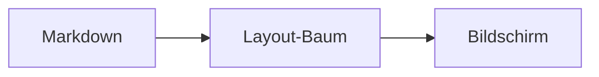

# Schaufenster

*[English version](showcase.md)*

Diese Datei verwendet jedes Markdown-Element, das mdVü versteht — in mdVü geöffnet, zeigt sie den vollen Umfang des Renderers in einem Durchlauf. Der Block oben ist **Frontmatter**: Metadaten am Dateianfang, die als gedämpfter Monospace-Block erscheinen statt versteckt zu werden. Die vollständige Referenz steht in [Markdown-Unterstützung](../docs/markdown-support.de.md).

## Überschriften

Die Überschrift oben ist Ebene 1. Darunter folgen die übrigen — sie bilden zugleich den Gliederungsbaum links, dieser Abschnitt eignet sich also gut zum Herumklicken darin.

### Ebene 3

#### Ebene 4

##### Ebene 5

###### Ebene 6

Setext-Überschriften gehen auch
===============================

Und die zweite Sorte
--------------------

## Text

Gewöhnliche Absätze sind einfach Text. Eine Leerzeile beginnt einen neuen.

Dieser Absatz zeigt die Inline-Auszeichnungen: *kursiv*, **fett**, ***beides zugleich***, `Inline-Code`, ~~durchgestrichen~~ und ein [Link auf das Handbuch](../docs/manual.de.md). Unbalancierte Auszeichnung wie **diese hier ist unproblematisch — sie bleibt wörtlicher Text, statt den Rest des Absatzes zu verschlucken.

Ein harter Zeilenumbruch sind zwei Leerzeichen am Zeilenende —  
es geht hier weiter, im selben Absatz. Ein Backslash am Ende tut dasselbe.\
So wie hier.

Emoji erscheinen farbig: 🎉 🚀 📄 ✅ — auch die, die Windows aus einer Farbschrift zeichnet.

## Listen

- Eine Aufzählung
- mit einem zweiten Punkt
  - und einem verschachtelten
    - und einer Ebene tiefer
- zurück auf der obersten Ebene

1. Eine nummerierte Liste
2. Zweitens
3. Drittens
   1. Verschachtelt, eigene Zählung
   2. Zweiter verschachtelter Punkt

Listen dürfen bei jeder Zahl beginnen:

7. Sieben
8. Acht
9. Neun

Aufgabenlisten:

- [x] Beispieldatei schreiben
- [x] Jedes Element unterbringen
- [ ] Jemanden zum Lesen überreden
- [ ] Die Weltherrschaft an mich reißen

## Zitate und Callouts

> Ein einfaches Blockzitat.
> Es darf über mehrere Zeilen gehen und trägt **Inline-Auszeichnungen** wie ein Absatz.

> Zitate verschachteln sich:
> > und das innere wird weiter eingerückt.

Callouts sind Zitate mit einem Typ. Ohne Zutun erscheinen sie wie gewöhnliche Zitate — [mit Farben versehen](../docs/css-customizing.de.md#callouts-einfärben) in der eigenen `user.css` erwachen sie zum Leben:

> [!note] Gut zu wissen
> Der Titel hinter dem Typ ist optional.

> [!warning]
> Ohne Titel steht der Typ allein.

> [!tip] Jeder Name funktioniert
> mdVü führt keine Liste erlaubter Typen — `[!spoiler]`, `[!rezept]` und `[!bananen]` sind alle in Ordnung.

## Code

Inline-Code sieht so aus: `hier`. Gefencete Blöcke werden hervorgehoben, sobald der Zaun eine Sprache nennt:

```python
def fibonacci(n: int) -> int:
    """Der Klassiker, mit Kommentar und Zeichenkette."""
    a, b = 0, 1              # zwei Zahlen
    for _ in range(n):
        a, b = b, a + b
    return a
```

```sql
select kunden_id, sum(betrag) as umsatz
from bestellungen
where bestelldatum >= '2026-01-01'   -- Kommentar
group by kunden_id
having sum(betrag) > 1000;
```

```json
{
  "name": "mdVü",
  "version": "0.7.0",
  "netzwerk": false,
  "grenzen": { "ladeMB": 50, "seiten": 200 }
}
```

Eine unbekannte Sprache bleibt in der normalen Code-Farbe, statt falsch eingefärbt zu werden:

```klingonisch
Qapla'!  (das ist in Ordnung)
```

Eingerückte Codeblöcke funktionieren ebenfalls — vier Leerzeichen:

    schlichter eingerückter Code
    keine Sprache, keine Hervorhebung

[`code-samples.de.md`](code-samples.de.md) zeigt ein Dutzend Sprachen hintereinander.

## Tabellen

| Sprache | Erschienen | Noch im Einsatz |
|:--------|-----------:|:---------------:|
| Pascal  |       1970 |        ja       |
| C       |       1972 |        ja       |
| Perl    |       1987 |    kommt drauf an |

Die Ausrichtungszeile entscheidet über die Spalten: links, rechts, zentriert. Zellen tragen Inline-Auszeichnungen — **fett**, `Code`, [Links](../README.de.md) — aber keine Blockelemente.

| Ausgefranste Eingabe | wird toleriert |
|---|---|
| fehlende Zellen werden aufgefüllt |
| überzählige | werden | verworfen |

## Trennlinien

Drei Schreibweisen für dieselbe Linie:

---

***

___

## Bilder


Der Größenzusatz `|320` setzt die Breite, die Höhe folgt proportional. Zwei Bilder in einem Absatz stehen nebeneinander:

 

Ein Bild muss ein eigener Absatz sein — eines mitten im Satz wie  zeigt nichts als seinen Alternativtext.

Eine fehlende Datei hinterlässt ihren Alternativtext:


## Links

- Relativ auf eine andere Datei: [das Handbuch](../docs/manual.de.md)
- Auf eine Überschrift in diesem Dokument: [zurück nach oben](#schaufenster)
- Auf eine Überschrift in einer anderen Datei: [CSS-Einheiten](../docs/css-customizing.de.md#einheiten)
- Ein Autolink: <https://example.com>
- Eine nackte URL: https://example.com
- Wikilink-Schreibweise: [[code-samples.de.md]] und [[code-samples.de.md|mit Anzeigetext]]

Externe Links fragen nach, bevor der Browser aufgeht. Man beachte das `.md` in den Wikilinks: mdVü nimmt das Ziel wörtlich, statt den Ordner nach einer passenden Notiz zu durchsuchen — [[code-samples]] erscheint als Link, führt aber ins Leere.

## Was absichtlich nichts tut

Manches wird als einfacher Text gezeigt statt gerendert — das ist der ehrliche Teil dieses Beispiels:

Rohes HTML bleibt wörtlich: <b>nicht fett</b> und <span style="color:red">nicht rot</span>.

Eine Fußnoten-Referenz[^1] ist wörtlicher Text.

[^1]: …und ihre Definition ebenso.

Ein Referenz-Link [wie dieser][ref] bleibt so stehen, wie er geschrieben ist.

[ref]: https://example.com

Mathematik bleibt Text: $E = mc^2$.

Ein Mermaid-Zaun erscheint als Codeblock:



---

*Teil der mdVü-Beispieldateien · MIT-lizenziert · [zurück zum README](../README.de.md)*
