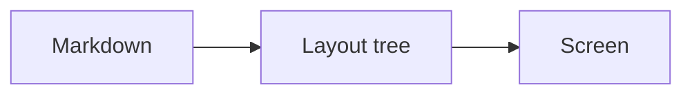

# Showcase

*[Deutsche Version](showcase.de.md)*

This file uses every Markdown element mdVü understands — open it in mdVü and you see the renderer's full range in one scroll. The block above is **front matter**: metadata at the top of the file, shown as a dimmed monospaced block rather than hidden. See [Markdown support](../docs/markdown-support.md) for the complete reference.

## Headings

The heading above is level 1. Below are the rest — they also make up the outline tree on the left, so this section is a good place to try clicking around in it.

### Level 3

#### Level 4

##### Level 5

###### Level 6

Setext headings work too
========================

And the second kind
-------------------

## Text

Plain paragraphs are just text. A blank line starts a new one.

This paragraph shows the inline markup: *italic*, **bold**, ***both at once***, `inline code`, ~~struck through~~, and a [link to the manual](../docs/manual.md). Unbalanced markup like **this one is fine — it stays literal text instead of eating the rest of the paragraph.

A hard line break is two spaces at the end of a line —  
which continues here, in the same paragraph. A backslash at the end works as well.\
Like this.

Emoji render in colour: 🎉 🚀 📄 ✅ — including the ones Windows draws from a colour font.

## Lists

- An unordered list
- with a second item
  - and a nested one
    - and one level deeper
- back at the top level

1. An ordered list
2. Second
3. Third
   1. Nested, numbered independently
   2. Second nested

Lists may start at any number:

7. Seven
8. Eight
9. Nine

Task lists:

- [x] Write the sample file
- [x] Include every element
- [ ] Convince someone to read it
- [ ] Take over the world

## Quotes and callouts

> A plain block quote.
> It may span several lines and contains **inline markup** just like a paragraph.

> Quotes nest:
> > and the inner one is indented further.

Callouts are quotes with a type. Out of the box they render like ordinary quotes — [give them colours](../docs/css-customizing.md#colouring-callouts) in your `user.css` and they come to life:

> [!note] Worth knowing
> The title after the type is optional.

> [!warning]
> Without a title, the type stands alone.

> [!tip] Any name works
> mdVü doesn't keep a list of allowed types — `[!spoiler]`, `[!recipe]` and `[!bananas]` are all fine.

## Code

Inline code looks like `this`. Fenced blocks are highlighted when the fence names a language:

```python
def fibonacci(n: int) -> int:
    """The classic, with a comment and a string."""
    a, b = 0, 1              # two numbers
    for _ in range(n):
        a, b = b, a + b
    return a
```

```sql
select customer_id, sum(total) as revenue
from orders
where order_date >= '2026-01-01'   -- comment
group by customer_id
having sum(total) > 1000;
```

```json
{
  "name": "mdVü",
  "version": "0.7.0",
  "network": false,
  "limits": { "loadMB": 50, "pages": 200 }
}
```

An unknown language stays in the plain code colour instead of being coloured wrongly:

```klingon
Qapla'!  (this is fine)
```

Indented code blocks work as well — four spaces:

    plain indented code
    no language, no highlighting

[`code-samples.md`](code-samples.md) shows a dozen languages in a row.

## Tables

| Language | First released | Still in use |
|:---------|---------------:|:------------:|
| Pascal   |           1970 |      yes     |
| C        |           1972 |      yes     |
| Perl     |           1987 |    depends   |

The alignment row decides the columns: left, right, centred. Cells hold inline markup — **bold**, `code`, [links](../README.md) — but no block elements.

| Ragged input | is tolerated |
|---|---|
| missing cells are padded |
| extra ones | are | dropped |

## Rules

Three ways to write a horizontal rule, all equivalent:

---

***

___

## Images


The size suffix `|320` sets the width; the height follows proportionally. Two images in one paragraph end up side by side:

 

An image has to be a paragraph of its own — one in the middle of a sentence like  shows nothing but its alt text.

A missing file leaves its alt text behind:


## Links

- Relative to another file: [the manual](../docs/manual.md)
- To a heading in this document: [back to the top](#showcase)
- To a heading in another file: [CSS units](../docs/css-customizing.md#units)
- An autolink: <https://example.com>
- A bare URL: https://example.com
- Wikilink style: [[code-samples.md]] and [[code-samples.md|with display text]]

External links ask for confirmation before your browser opens. Note the `.md` in the wikilinks: mdVü takes the target literally instead of searching the folder for a matching note — [[code-samples]] renders as a link but leads nowhere.

## What deliberately does nothing

Some things are shown as plain text rather than rendered — this is the honest part of the sample:

Raw HTML stays literal: <b>not bold</b> and <span style="color:red">not red</span>.

A footnote reference[^1] is literal text.

[^1]: …and so is its definition.

A reference link [like this][ref] stays as written.

[ref]: https://example.com

Math stays text: $E = mc^2$.

A mermaid fence renders as a code block:



---

*Part of the mdVü sample files · MIT licensed · [back to the README](../README.md)*
